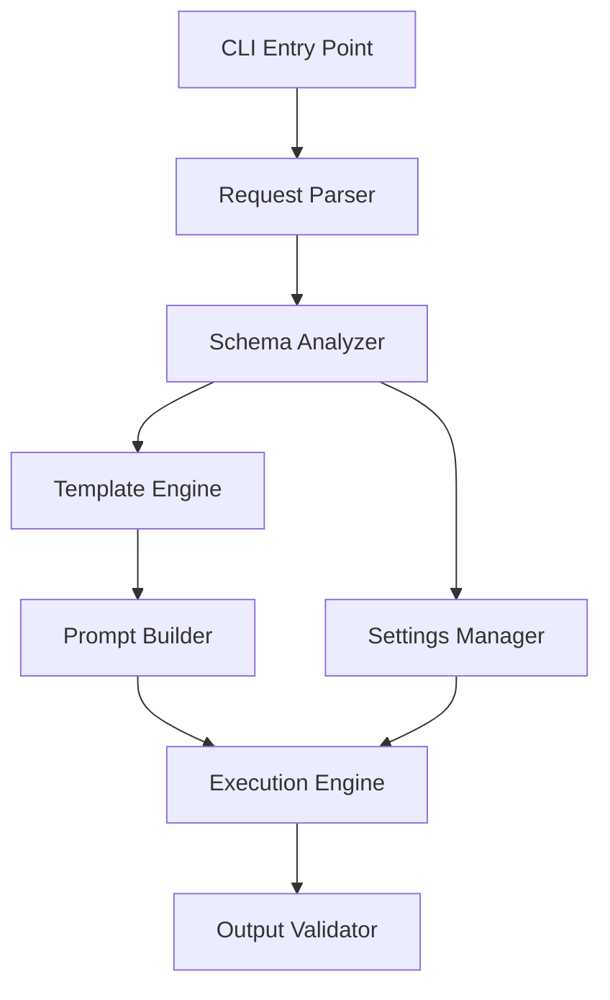

# CLAUDE.md

This file provides guidance to Claude Code (claude.ai/code) when working with code in this repository.

## 프로젝트 개요

VibeCraft-Agent는 SQLite 데이터베이스를 입력으로 받아 Gemini CLI를 통해 React 기반 데이터 시각화 애플리케이션을 자동 생성하는 CLI 도구입니다.

## 핵심 아키텍처

### 시스템 역할 분담
- **VibeCraft-Agent**: 프롬프트 준비, settings.json 생성, Gemini CLI 실행, 결과 검증
- **Gemini CLI**: 실제 React 코드 생성, 파일 생성, MCP 서버와 통신
- **MCP SQLite Server**: SQLite 데이터베이스 접근 제공

### 주요 컴포넌트
1. **CLI Interface**: 명령행 인터페이스 제공
2. **RequestParser**: CLI 인자 파싱 및 검증
3. **SchemaAnalyzer**: SQLite 스키마 분석
4. **TemplateEngine**: 시각화 타입별 템플릿 처리
5. **SettingsManager**: Gemini CLI settings.json 생성
6. **PromptBuilder**: 최종 프롬프트 조합
7. **ExecutionEngine**: Gemini CLI 실행 관리
8. **OutputValidator**: 생성된 앱 검증

### 실행 플로우
1. 입력 검증
2. 작업 디렉토리 생성
3. SQLite 스키마 추출
4. Settings 파일 생성 (.gemini/settings.json)
5. 프롬프트 생성 (시스템 + 타입별 + 사용자 프롬프트)
6. Gemini CLI 실행
7. SQLite 파일을 public/ 디렉토리로 복사
8. 결과 검증
9. 성공/실패 반환

## 프롬프트 시스템

### 프롬프트 구성
- **시스템 프롬프트**: VibeCraft-viz 역할 정의, 기술 스택, 프로젝트 구조
- **타입별 템플릿**: time-series, geo-spatial, gantt-chart 등 시각화 타입별 특화 템플릿
- **사용자 프롬프트**: 백엔드에서 전달받은 구체적인 요구사항

### 필수 기술 스택
- React 18.x
- TypeScript (선택적)
- Recharts/Chart.js (시각화)
- sql.js (브라우저 SQLite)
- Tailwind CSS (스타일링)

## 개발 가이드

### 디렉토리 구조
```
vibecraft-agent/
├── src/
│   ├── cli.ts              # CLI 진입점
│   ├── core/               # 핵심 모듈
│   ├── templates/          # 프롬프트 템플릿
│   ├── settings/           # Settings 생성
│   ├── schema/             # 스키마 추출
│   └── utils/              # 유틸리티
├── templates/              # 템플릿 리소스
└── package.json
```

### CLI 사용법
```bash
vibecraft-agent \
  --sqlite-path /path/to/data.sqlite \
  --visualization-type time-series \
  --user-prompt "월별 매출 추이 대시보드" \
  --output-dir ./output
```

### 주요 인터페이스
```typescript
interface AgentCliArgs {
  sqlitePath: string;
  visualizationType: VisualizationType;
  userPrompt: string;
  outputDir: string;
  projectName?: string;
  debug?: boolean;
}

type VisualizationType = 
  | 'time-series' | 'geo-spatial' | 'gantt-chart' 
  | 'kpi-dashboard' | 'comparison' | 'funnel-analysis'
  | 'cohort-analysis' | 'heatmap' | 'network-graph' | 'custom';
```

## 중요 구현 세부사항

### MCP 서버 설정
- settings.json은 작업 디렉토리의 `.gemini/` 폴더에 생성
- SQLite 파일 경로는 절대 경로로 변환
- MCP 서버는 Python 기반 (`mcp-server-sqlite`)

### 프롬프트 최적화
- 스키마 정보를 구체적으로 포함
- 실제 SQL 쿼리 예시 추가
- sql.js 사용 패턴 명시

### Output Validator 검증 항목
- package.json 존재 및 유효성
- React 앱 필수 파일 (App.tsx, index.html)
- SQLite 파일이 public/에 복사되었는지 확인

### Gemini CLI 실행
- 별도 프로세스로 실행
- GEMINI_SETTINGS_DIR 환경변수로 settings 위치 지정
- 작업 디렉토리를 --working-directory로 지정

## 새 시각화 타입 추가
1. `templates/` 디렉토리에 새 템플릿 디렉토리 생성 (예: `templates/my-visualization/`)
2. `meta.json` 파일 작성 - 시각화 타입의 메타데이터와 구조 정의
3. `prompt.md` 파일 작성 - 실제 프롬프트 내용
4. VisualizationType enum에 새 타입 추가
5. 필요시 TemplateEngine에서 추가 처리 로직 구현

## 테스트 전략
테스트 전략과 가이드라인은 `docs/testing-strategy.md` 참조

## 프로젝트 문서
- 시스템 개요: `docs/gemini-cli-data-visualization-report.md`
- 기술 아키텍처: `docs/technical-architecture.md`
- 테스트 전략: `docs/testing-strategy.md`

## 개발 진행 상황

### 태스크 진행 추적
**중요**: 각 태스크가 완료될 때마다 반드시 다음 파일들을 업데이트해야 합니다:
1. `tasks/task-progress-tracker.md` - 태스크 진행 상황 업데이트
2. `CLAUDE.md` - 개발 진행 상황 섹션 업데이트
3. TodoWrite 도구 - 태스크 상태 업데이트

### 완료된 작업
- **Task 1**: 프로젝트 초기 설정 및 기본 구조 생성 ✓
  - package.json 및 설정 파일 생성
  - TypeScript, ESLint, Prettier, Jest 설정
  - 디렉토리 구조 생성
  - 타입 정의 (src/types/index.ts)
  - 모든 핵심 모듈 placeholder 파일 생성

- **Task 2**: CLI 인터페이스 구현 (Commander.js 사용) ✓
  - 단일 명령 구조 구현 (협의된 대로)
  - --list-types 옵션 구현
  - 입력 검증 유틸리티 (src/utils/validation.ts)
  - 에러 처리 및 사용자 피드백
  - Agent 기본 구조 구현

- **Task 3**: Request Parser 모듈 구현 ✓
  - RequestParser 클래스 구현 (입력 파싱/검증)
  - AdvancedValidator 클래스 구현 (SQLite 스키마 검증)
  - RequestNormalizer 클래스 구현 (요청 정규화)
  - 작업 디렉토리 생성 로직
  - 유닛 테스트 작성 완료
  - Agent 클래스와 통합 완료

- **Task 4**: Schema Analyzer 모듈 구현 ✓
  - SchemaAnalyzer 클래스 구현 (SQLite 스키마 분석)
  - 포괄적인 타입 시스템 정의
  - 테이블, 컬럼, 관계 정보 추출
  - 데이터 분포 통계 및 타입 추론
  - SchemaSummarizer 유틸리티 클래스
  - 테스트 작성 완료 (9개 테스트 통과)
  - Agent 클래스와 통합 완료

- **Task 5**: Template Engine 모듈 구현 ✓
  - TemplateEngine 클래스 구현 (Markdown 기반)
  - 템플릿 로드, 캐싱, 렌더링 기능
  - 변수 치환 시스템 ({{VARIABLE_NAME}} 형식)
  - 템플릿 검증 및 호환성 검사
  - TemplateSelector 유틸리티 (시각화 추천)
  - 테스트 작성 완료 (12개 테스트 통과)
  - Agent 클래스와 통합 완료
  - 예제 템플릿 작성 (time-series, kpi-dashboard)

- **Task 6**: Settings Manager 모듈 구현 ✓
  - SettingsManager 클래스 구현 (settings.json 생성)
  - MCP SQLite 서버 설정 자동 생성
  - 실행 방식 자동 결정 (Python 모듈 vs UV)
  - SettingsHelper 유틸리티 클래스
  - EnvironmentManager 클래스 (환경 변수 관리)
  - 테스트 작성 완료 (24개 테스트 통과)
  - Agent 클래스와 통합 완료

- **Task 7**: Prompt Builder 모듈 구현 ✓
  - PromptBuilder 클래스 구현 (buildPrompt, optimizePrompt)
  - 시스템 프롬프트 템플릿 정의
  - 스키마 정보 포맷팅
  - 템플릿 콘텐츠 및 사용자 요구사항 통합
  - 프롬프트 최적화 기능 (토큰 제한, 포커스 영역)
  - PromptValidator 유틸리티 클래스
  - 테스트 작성 완료 (18개 테스트 통과)
  - Agent 클래스와 통합 완료 (프롬프트 생성/검증/저장)

- **Task 8**: Execution Engine 모듈 구현 ✓
  - ExecutionEngine 클래스 구현 (execute, monitorExecution, cancelExecution)
  - Gemini CLI 실행 로직 (-p 옵션 vs stdin 자동 선택)
  - 프로세스 관리 및 모니터링 (EventEmitter 기반)
  - ProcessManager 유틸리티 클래스 (Singleton 패턴)
  - ExecutionMonitor 클래스 (메트릭 수집)
  - 테스트 작성 완료 (14개 테스트 통과)
  - Agent 클래스와 통합 완료 (Gemini CLI 실행 및 기본 검증)
  
### 진행 중인 작업
없음

### 구현된 구조



### 핵심 타입 정의
```typescript
// src/types/index.ts
export type VisualizationType = 
  | 'time-series' | 'geo-spatial' | 'gantt-chart' 
  | 'kpi-dashboard' | 'comparison' | 'funnel-analysis'
  | 'cohort-analysis' | 'heatmap' | 'network-graph' | 'custom';

export interface AgentCliArgs {
  sqlitePath: string;
  visualizationType: VisualizationType;
  userPrompt: string;
  outputDir: string;
  projectName?: string;
  debug?: boolean;
}
```

## Task Master AI Instructions
**Import Task Master's development workflow commands and guidelines, treat as if import is in the main CLAUDE.md file.**
@./.taskmaster/CLAUDE.md
