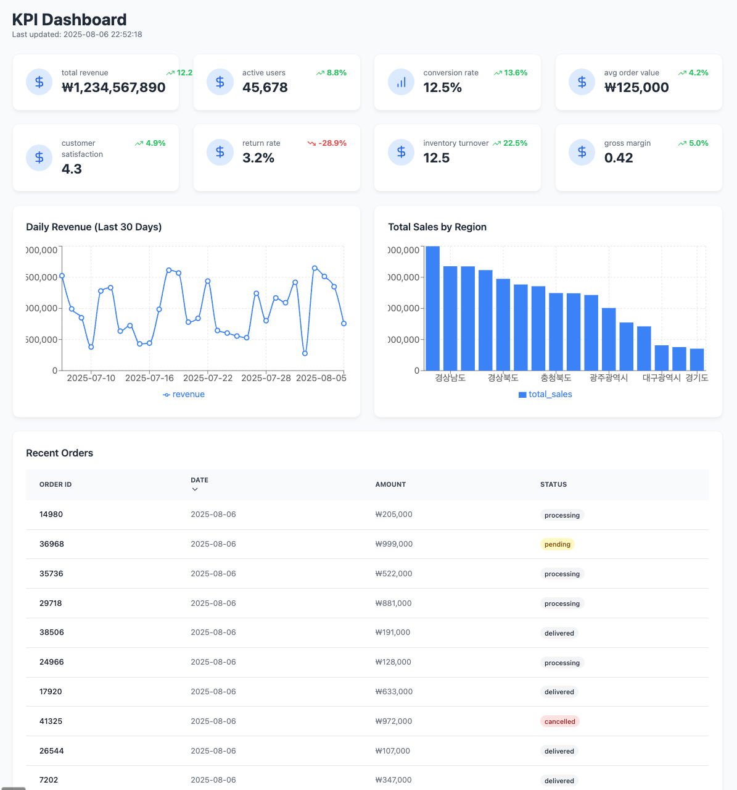

# VibeCraft-Agent

SQLite 데이터베이스를 기반으로 Gemini CLI를 활용하여 React 데이터 시각화 애플리케이션을 자동 생성하는 CLI 도구입니다.

> 🎉 **90%+ 성공률**로 원샷 프롬프트만으로 즉시 실행 가능한 React 앱을 생성합니다!


*실제 생성된 KPI 대시보드 예시*

## 🚀 주요 기능

- **실전 검증된 시각화 타입**: time-series, geo-spatial, kpi-dashboard, comparison 등
- **원샷 프롬프트**: 한 번의 명령으로 완전한 React 앱 생성
- **자체 검증 기능**: 생성 후 자동으로 빌드 검증 및 TypeScript 에러 수정
- **스마트 컬럼 매핑**: 다양한 데이터베이스 스키마에 자동 적응
- **즉시 실행 가능**: `npm install && npm run dev`로 바로 실행

## 📋 기술 스택

생성되는 앱은 다음 기술을 사용합니다:
- **Vite**: 빠른 개발 서버와 빌드
- **React 18**: 최신 React 기능 활용
- **TypeScript**: 타입 안정성
- **Recharts**: 데이터 시각화
- **Tailwind CSS**: 스타일링
- **sql.js**: 브라우저에서 SQLite 실행

## 📦 NPM 패키지

[](https://www.npmjs.com/package/vibecraft-agent)
[](https://www.npmjs.com/package/vibecraft-agent)

```bash
npm install -g vibecraft-agent
```

NPM 패키지 페이지: https://www.npmjs.com/package/vibecraft-agent

## 🔧 설치 및 실행

### npm으로 설치 (권장)

```bash
# 1. VibeCraft-Agent 설치
npm install -g vibecraft-agent

# 2. Gemini CLI 설치 (필수!)
# Gemini CLI 설치 방법은 공식 문서 참조
# https://github.com/google-gemini/gemini-cli

# 3. 환경 변수 설정
export GEMINI_API_KEY=YOUR_API_KEY
# 또는 .env 파일 생성
echo "GEMINI_API_KEY=YOUR_API_KEY" > .env

# 4. 사용
vibecraft-agent \
  --sqlite-path ./data.sqlite \
  --visualization-type time-series \
  --user-prompt "월별 매출 추이" \
  --output-dir ./dashboard
```

### 소스에서 설치

```bash
# 1. 프로젝트 클론
git clone https://github.com/your-org/vibecraft-agent
cd vibecraft-agent

# 2. 의존성 설치 및 빌드
npm install
npm run build

# 3. 환경 설정
cp .env.example .env
# .env 파일을 열어서 GEMINI_API_KEY 입력

# 4. Gemini CLI 설치 (필수!)
# 설치 방법은 공식 문서 참조

# 5. 전역 설치
npm link

# 6. 사용
vibecraft-agent \
  --sqlite-path ./data.sqlite \
  --visualization-type time-series \
  --user-prompt "월별 매출 추이" \
  --output-dir ./dashboard
```

### 필수 사전 요구사항

#### 1. Node.js (v18 이상)

```bash
# Node.js 버전 확인
node --version  # v18.0.0 이상이어야 함
```

#### 2. Gemini API Key (필수)

Google AI Studio에서 API 키를 발급받아야 합니다:

1. [Google AI Studio](https://makersuite.google.com/app/apikey) 방문
2. "Create API Key" 클릭
3. 생성된 키를 `.env` 파일에 설정

```bash
# .env 파일 생성
cp .env.example .env

# .env 파일 편집하여 API 키 추가
GEMINI_API_KEY=your-api-key-here
```

#### 3. Gemini CLI 설치 (필수)

⚠️ **중요**: VibeCraft-Agent는 Gemini CLI를 사용하여 코드를 생성합니다. 
Gemini CLI는 별도로 설치해야 합니다:

```bash
# Gemini CLI 설치 확인
gemini --version

# 설치되어 있지 않다면 반드시 설치 필요
# Gemini CLI 공식 저장소에서 설치 방법 확인
```

**참고**: `npm install -g vibecraft-agent`를 실행해도 Gemini CLI는 자동으로 설치되지 않습니다.
Gemini CLI는 독립적인 도구이므로 별도 설치가 필요합니다.

## 🚀 빠른 시작

### 1. 샘플 데이터 생성 (첫 실행 시)

```bash
# 샘플 SQLite 데이터베이스 생성
python3 demo/generate_timeseries_data.py
python3 demo/generate_geospatial_data.py
python3 demo/generate_kpi_data.py
python3 demo/csv_to_sqlite.py
```

### 2. 시각화 앱 생성 및 실행

```bash
# KPI 대시보드 생성
vibecraft-agent \
  --sqlite-path demo/metrics.sqlite \
  --visualization-type kpi-dashboard \
  --user-prompt "핵심 지표 카드" \
  --output-dir ./output

# 생성된 앱 실행
cd ./output/vibecraft-*
npm install
npm run dev
```

브라우저에서 http://localhost:5173 접속

## 💻 사용법

### 기본 명령어

```bash
vibecraft-agent \
  --sqlite-path /path/to/your/data.sqlite \
  --visualization-type <type> \
  --user-prompt "시각화 요구사항" \
  --output-dir ./output
```

### 옵션 설명

| 옵션 | 설명 | 필수 | 기본값 |
|------|------|------|--------|
| `--sqlite-path` | SQLite 데이터베이스 파일 경로 | ✅ | - |
| `--visualization-type` | 시각화 타입 (아래 참조) | ✅ | - |
| `--user-prompt` | 시각화 요구사항 설명 | ✅ | - |
| `--output-dir` | 생성될 React 앱 디렉토리 | ❌ | ./output |
| `--project-name` | 프로젝트 이름 | ❌ | 자동 생성 |
| `--model` | Gemini 모델 선택 (flash/pro) | ❌ | flash |
| `--debug` | 디버그 모드 활성화 | ❌ | false |

### 지원하는 시각화 타입

```bash
# 사용 가능한 시각화 타입 목록 보기
vibecraft-agent --list-types
```

| 타입 | 설명 | 주요 용도 |
|------|------|-----------|
| `time-series` | 시계열 분석 | 시간에 따른 추이, 트렌드 분석 |
| `geo-spatial` | 지도 시각화 | 위치 기반 데이터, 지역별 통계 |
| `kpi-dashboard` | KPI 대시보드 | 핵심 지표, 메트릭 카드 |
| `comparison` | 비교 분석 | 카테고리별 비교, A/B 분석 |

## 🆕 모델 선택 (무료 사용자 지원)

### Gemini 모델 옵션
- **flash** (기본값): gemini-2.5-flash - 무료 사용자 추천 (100 req/min)
- **pro**: gemini-2.5-pro - 고품질 코드 생성 (5 req/min)

```bash
# 무료 사용자 (기본값)
vibecraft-agent \
  --sqlite-path ./data.sqlite \
  --visualization-type kpi-dashboard \
  --user-prompt "매출 대시보드"
  # --model 옵션 생략 시 flash 자동 선택

# 고품질 코드 필요 시
vibecraft-agent \
  --sqlite-path ./data.sqlite \
  --visualization-type kpi-dashboard \
  --user-prompt "복잡한 대시보드" \
  --model pro
```

### 환경 변수로 기본 모델 설정
```bash
# .env 파일
GEMINI_MODEL=flash  # 또는 pro
```

## 📊 실제 사용 예시

### 1. 시계열 분석 (IoT 센서 데이터)

```bash
vibecraft-agent \
  --sqlite-path demo/sales.sqlite \
  --visualization-type time-series \
  --user-prompt "일별 매출 트렌드" \
  --output-dir ./output
```

### 2. KPI 대시보드 (비즈니스 메트릭)

```bash
vibecraft-agent \
  --sqlite-path demo/metrics.sqlite \
  --visualization-type kpi-dashboard \
  --user-prompt "핵심 지표 카드" \
  --output-dir ./output
```

### 3. 지리공간 시각화 (매장 위치)

```bash
vibecraft-agent \
  --sqlite-path demo/stores.sqlite \
  --visualization-type geo-spatial \
  --user-prompt "매장 위치와 매출" \
  --output-dir ./output
```

### 4. 비교 분석 (제품/채널)

```bash
vibecraft-agent \
  --sqlite-path demo/metrics.sqlite \
  --visualization-type comparison \
  --user-prompt "제품 카테고리별 매출을 막대 차트로, 판매 채널별 비중을 파이 차트로 나란히 표시" \
  --output-dir ./output
```

## 🔍 생성된 앱 실행하기

1. 생성된 디렉토리로 이동:
   ```bash
   cd ./sales-dashboard
   ```

2. 의존성 설치:
   ```bash
   npm install
   ```

3. 개발 서버 실행:
   ```bash
   npm run dev
   ```

4. 브라우저에서 http://localhost:5173 접속

## ⚙️ 환경 설정

### 환경 변수 설정 방법

VibeCraft-Agent는 `.env` 파일을 통해 환경 설정을 관리합니다:

```bash
# 1. .env.example 파일 복사
cp .env.example .env

# 2. .env 파일 편집
nano .env  # 또는 원하는 편집기 사용
```

### 필수 환경 변수

**GEMINI_API_KEY만 있으면 실행 가능합니다!**

```bash
# .env 파일
GEMINI_API_KEY=your-api-key-here
```

Google Cloud 설정이나 다른 복잡한 설정은 필요 없습니다. 
Gemini API Key 하나만 있으면 바로 사용할 수 있습니다.

## 📦 샘플 데이터베이스

`demo/` 폴더에 다양한 시각화 타입을 테스트할 수 있는 샘플 데이터 생성 스크립트가 포함되어 있습니다.

### 샘플 데이터 생성하기

Python 스크립트로 대용량 샘플 데이터베이스를 생성할 수 있습니다:

```bash
# 1. CSV 데이터 생성 (각 10-17MB)
python3 demo/generate_timeseries_data.py   # IoT 센서 데이터 (100,000 레코드)
python3 demo/generate_geospatial_data.py   # 매장 위치 데이터 (80,000 레코드)
python3 demo/generate_kpi_data.py          # 비즈니스 거래 데이터 (100,000 레코드)

# 2. CSV를 SQLite로 변환
python3 demo/csv_to_sqlite.py

# 생성된 데이터베이스:
# - demo/sales.sqlite (11.18 MB) - Time-series 시각화용
# - demo/stores.sqlite (176 KB) - Geo-spatial 시각화용 (1,000개 샘플)
# - demo/metrics.sqlite (14.72 MB) - KPI Dashboard용
```

자세한 스키마 정보와 데이터 구조는 [demo/DATA_INFO.md](./demo/DATA_INFO.md) 참조

### 샘플 명령어

생성된 데이터베이스로 각 시각화 타입 테스트:

```bash
# 1. Time-series 시각화 (일별 매출 트렌드)
vibecraft-agent \
  --sqlite-path demo/sales.sqlite \
  --visualization-type time-series \
  --user-prompt "일별 매출 트렌드" \
  --output-dir ./output

# 2. Geo-spatial 시각화 (매장 위치와 매출)
vibecraft-agent \
  --sqlite-path demo/stores.sqlite \
  --visualization-type geo-spatial \
  --user-prompt "매장 위치와 매출" \
  --output-dir ./output

# 3. KPI Dashboard (핵심 지표 카드)
vibecraft-agent \
  --sqlite-path demo/metrics.sqlite \
  --visualization-type kpi-dashboard \
  --user-prompt "핵심 지표 카드" \
  --output-dir ./output

# 4. Comparison (비교 분석)
vibecraft-agent \
  --sqlite-path demo/metrics.sqlite \
  --visualization-type comparison \
  --user-prompt "제품 카테고리별 매출을 막대 차트로, 판매 채널별 비중을 파이 차트로 나란히 표시" \
  --output-dir ./output
```

### 생성된 앱 실행

```bash
# 생성된 프로젝트로 이동 (자동 생성된 폴더명)
cd ./output/vibecraft-*

# 의존성 설치 및 실행
npm install
npm run dev
```

브라우저에서 http://localhost:5173 접속

## 🐛 문제 해결

### 1. GEMINI_API_KEY가 설정되지 않음
```bash
❌ Error: GEMINI_API_KEY is not set
```
**해결**: 
```bash
cp .env.example .env
# .env 파일 편집하여 API Key 입력
```

### 2. Gemini CLI를 찾을 수 없음
```bash
Error: Gemini CLI not found. Please install it first.
```
**해결**: Gemini CLI 설치 필요

### 3. 샘플 대시보드 실행 시 에러
```bash
Error: Cannot find module 'react'
```
**해결**: 
```bash
# 각 샘플 폴더에서 개별 설치 필요
cd demo/kpi-dashboard
npm install
npm run dev
```

### 4. 타임아웃 문제
생성 중 5분 타임아웃이 발생해도 앱은 정상적으로 생성됩니다:
```bash
cd ./output/vibecraft-*
npm run build  # 빌드 확인
npm run dev    # 개발 서버 실행
```

## 📚 추가 문서

- [기여 가이드](./CONTRIBUTING.md)
- [샘플 대시보드 상세 가이드](./demo/README.md)

## 🤝 기여하기

새로운 시각화 타입을 추가하거나 기능을 개선하고 싶으시다면:

1. Fork & Clone
2. 새 브랜치 생성 (`git checkout -b feature/amazing-visualization`)
3. 변경사항 커밋 (`git commit -m 'Add amazing visualization'`)
4. Push (`git push origin feature/amazing-visualization`)
5. Pull Request 생성

자세한 내용은 [기여 가이드](./CONTRIBUTING.md)를 참조하세요.

## 📄 라이선스

이 프로젝트는 Apache License 2.0 하에 배포됩니다. 자세한 내용은 [LICENSE](./LICENSE) 파일을 참고하세요.