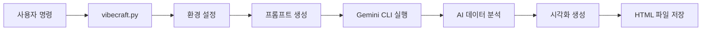

# VibeCraft Agent 🎨

<div align="center">

[](https://www.python.org/downloads/)
[](LICENSE)
[](https://github.com/google-gemini/gemini-cli)

**Gemini CLI를 활용한 에이전틱 데이터 시각화 도구**

[English](README_EN.md) | 한국어

</div>

## 🌟 소개

VibeCraft Agent는 Google의 Gemini CLI를 활용하여 데이터를 자동으로 분석하고 인터랙티브한 시각화를 생성하는 AI 기반 도구입니다. 사용자가 자연어로 요청하면, AI가 데이터를 읽고 분석하여 적절한 차트를 생성합니다.

### 🚀 주요 특징

- **🤖 완전 자동화**: 데이터 분석부터 시각화까지 AI가 자동으로 처리
- **💬 자연어 인터페이스**: "월별 매출 추이를 보여줘" 같은 자연스러운 요청 지원
- **📊 다양한 차트 타입**: 시계열, 막대, 파이, 산점도 등 자동 선택
- **🔄 실시간 스트리밍**: AI의 작업 과정을 실시간으로 확인 가능
- **🎯 에이전틱 동작**: Gemini CLI가 파일을 직접 읽고 처리

### 🎬 데모

```bash
# 기본 사용법
python vibecraft.py examples/sales_data.csv "월별 매출 추이를 보여줘"

# 스트리밍 모드
python vibecraft.py -s examples/sales_data.csv "카테고리별 매출 비교"
```

## 📋 요구사항

- Python 3.8 이상
- [Gemini CLI](https://github.com/google-gemini/gemini-cli) 설치 및 인증
- Google Cloud Project (Gemini API 사용)

## 🛠️ 설치

### 1. 저장소 클론

```bash
git clone https://github.com/vibecraft25/VibeCraft-Agent.git
cd vibecraft-agent
```

### 2. Python 의존성 설치

```bash
pip install -r requirements.txt
```

### 3. Gemini CLI 설치 및 설정

```bash
# Gemini CLI 설치 (npm 필요)
npm install -g @google/gemini-cli

# Google Cloud 인증
gemini auth login
```

### 4. 환경 설정

```bash
# .env 파일 생성
cp .env.example .env

# .env 파일 편집하여 설정 추가
# GOOGLE_CLOUD_PROJECT=your-project-id
# GEMINI_API_KEY=your-api-key
```

## 📖 사용법

### 기본 사용법

```bash
python vibecraft.py <데이터파일> "<시각화 요청>"
```

### 명령행 옵션

| 옵션 | 설명 | 예제 |
|------|------|------|
| `-s, --stream` | AI의 작업 과정을 실시간으로 표시 | `python vibecraft.py -s data.csv "차트"` |
| `-d, --debug` | 디버그 모드 활성화 | `python vibecraft.py -d data.csv "차트"` |
| `-o, --output` | 출력 파일명 지정 | `python vibecraft.py -o report.html data.csv "차트"` |

### 예제

#### 1. 시계열 차트
```bash
python vibecraft.py examples/sales_data.csv "월별 매출 추이를 보여줘"
```

#### 2. 막대 그래프
```bash
python vibecraft.py examples/sales_data_category.csv "카테고리별 매출 비교 막대그래프"
```

#### 3. 파이 차트
```bash
python vibecraft.py examples/sales_data_category.csv "카테고리별 매출 분포 파이차트"
```

#### 4. 스트리밍 모드로 실행
```bash
python vibecraft.py -s examples/sales_data.csv "월별 매출과 비용 비교"
```

## 🏗️ 아키텍처


```mermaid
graph LR
    A[사용자 명령] --> B[vibecraft.py]
    B --> C[환경 설정]
    C --> D[프롬프트 생성]
    D --> E[Gemini CLI 실행]
    E --> F[AI 데이터 분석]
    F --> G[시각화 생성]
    G --> H[HTML 파일 저장]
```

### 프로젝트 구조

```
vibecraft-agent-v2/
├── vibecraft.py                      # 메인 실행 파일
├── vibecraft-system-prompt.md        # 기본 시스템 프롬프트
├── vibecraft-system-prompt-verbose.md # 스트리밍 모드용 프롬프트
├── run.sh                           # 실행 편의 스크립트
├── .env.example                     # 환경 설정 예제
├── requirements.txt                 # Python 의존성
├── examples/                        # 예제 데이터
│   ├── sales_data.csv
│   └── sales_data_category.csv
├── tests/                          # 테스트 코드
├── docs/                           # 문서
└── README.md                       # 이 파일
```

### 핵심 구성요소

1. **vibecraft.py**: 메인 실행 파일
   - 환경 설정 관리
   - Gemini CLI 호출
   - 스트리밍 지원

2. **시스템 프롬프트**:
   - `vibecraft-system-prompt.md`: 기본 실행용
   - `vibecraft-system-prompt-verbose.md`: 상세 출력용

3. **Gemini CLI 통합**:
   - YOLO 모드(`-y`)로 자동 실행
   - 환경변수로 시스템 프롬프트 전달
   - 실시간 출력 스트리밍

## 🤝 기여하기

프로젝트에 기여하고 싶으신가요? 환영합니다! 

1. Fork the Project
2. Create your Feature Branch (`git checkout -b feature/AmazingFeature`)
3. Commit your Changes (`git commit -m 'Add some AmazingFeature'`)
4. Push to the Branch (`git push origin feature/AmazingFeature`)
5. Open a Pull Request

자세한 내용은 [CONTRIBUTING.md](CONTRIBUTING.md)를 참조해주세요.

## 🧪 테스트

```bash
# 테스트 실행
python -m pytest tests/

# 커버리지 포함
python -m pytest tests/ --cov=vibecraft
```

## 🚀 로드맵

- [ ] 다양한 데이터 형식 지원 (JSON, Excel)
- [ ] 실시간 데이터 업데이트
- [ ] 대시보드 템플릿 시스템
- [ ] REST API 지원
- [ ] 다국어 지원

## 📄 라이선스

이 프로젝트는 MIT 라이선스 하에 배포됩니다. 자세한 내용은 [LICENSE](LICENSE) 파일을 참조하세요.

## 🙏 감사의 말

- Google Gemini 팀의 훌륭한 AI 모델과 CLI 도구
- Plotly.js 팀의 강력한 시각화 라이브러리
- 모든 기여자와 사용자 여러분

## 📞 문의

- **이슈**: [GitHub Issues](https://github.com/pghoya2956/vibecraft-agent-v2/issues)
- **토론**: [GitHub Discussions](https://github.com/pghoya2956/vibecraft-agent-v2/discussions)
- **이메일**: your-email@example.com

## ⭐ Star History

[](https://star-history.com/#pghoya2956/vibecraft-agent-v2&Date)

---

<div align="center">
Made with ❤️ by VibeCraft Team
</div>