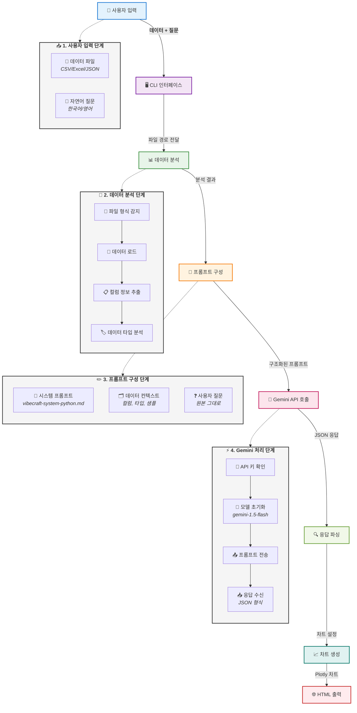

# VibeCraft 프롬프트 처리 과정 가이드

## 개요

VibeCraft는 사용자의 자연어 질문을 받아 데이터를 분석하고 적절한 시각화를 생성하는 AI 기반 도구입니다. 이 문서는 프롬프트가 입력되어 최종 차트가 생성되기까지의 전체 과정을 설명합니다.

## 프롬프트 처리 흐름



## 각 단계별 상세 설명

### 1. 사용자 입력 단계 (CLI)

**파일**: `vibecraft.py`

```python
# 사용자가 실행하는 명령
python vibecraft.py <데이터파일> "<질문>"

# 예시
python vibecraft.py sales_data.csv "월별 매출 추이를 보여줘"
```

- **데이터 파일**: CSV, Excel, JSON 형식 지원
- **질문**: 한국어 또는 영어로 원하는 분석이나 시각화 요청

### 2. 데이터 분석 단계

**파일**: `data_analyzer.py`

데이터를 로드하고 분석하여 AI가 이해할 수 있는 형식으로 변환:

```python
def analyze_data(file_path):
    # 1. 파일 형식 감지
    if file_path.endswith('.csv'):
        df = pd.read_csv(file_path)
    elif file_path.endswith('.xlsx'):
        df = pd.read_excel(file_path)
    elif file_path.endswith('.json'):
        df = pd.read_json(file_path)
    
    # 2. 데이터 정보 추출
    data_info = {
        "columns": list(df.columns),
        "shape": df.shape,
        "dtypes": df.dtypes.to_dict(),
        "sample": df.head().to_dict()
    }
    
    return data_info
```

### 3. 프롬프트 구성 단계

**파일**: `vibecraft-system-python.md` (시스템 프롬프트)

시스템 프롬프트는 Gemini에게 역할과 작업 방식을 정의합니다:

```markdown
You are a data visualization expert...

Given data with columns: [컬럼 정보]
User question: [사용자 질문]

Recommend the best visualization approach...
```

실제 프롬프트 구성:
```python
def build_prompt(data_info, user_query):
    # 시스템 프롬프트 로드
    with open('vibecraft-system-python.md', 'r') as f:
        system_prompt = f.read()
    
    # 데이터 컨텍스트 구성
    data_context = f"""
    Available columns: {data_info['columns']}
    Data shape: {data_info['shape']}
    Data types: {data_info['dtypes']}
    Sample data: {data_info['sample']}
    """
    
    # 최종 프롬프트 조합
    full_prompt = f"{system_prompt}\n\n{data_context}\n\nUser question: {user_query}"
    
    return full_prompt
```

### 4. Gemini API 호출

**파일**: `gemini_client.py`

```python
def get_chart_recommendation(prompt):
    # Gemini 모델 초기화
    genai.configure(api_key=os.getenv('GOOGLE_API_KEY'))
    model = genai.GenerativeModel('gemini-1.5-flash')
    
    # 프롬프트 전송 및 응답 수신
    response = model.generate_content(prompt)
    
    # 응답 파싱 (JSON 형식)
    chart_config = json.loads(response.text)
    
    return chart_config
```

### 5. 응답 형식

Gemini는 다음과 같은 JSON 형식으로 응답합니다:

```json
{
    "chart_type": "line",
    "title": "월별 매출 추이",
    "x_column": "date",
    "y_columns": ["sales"],
    "description": "시간에 따른 매출 변화를 보여주는 라인 차트",
    "plotly_config": {
        "layout": {
            "xaxis": {"title": "날짜"},
            "yaxis": {"title": "매출액"}
        }
    }
}
```

### 6. 차트 생성 단계

**파일**: `chart_generator.py`

```python
def generate_chart(df, chart_config):
    chart_type = chart_config['chart_type']
    
    if chart_type == 'line':
        fig = px.line(df, 
                      x=chart_config['x_column'],
                      y=chart_config['y_columns'],
                      title=chart_config['title'])
    elif chart_type == 'bar':
        fig = px.bar(df, 
                     x=chart_config['x_column'],
                     y=chart_config['y_columns'],
                     title=chart_config['title'])
    # ... 다른 차트 타입들
    
    # Plotly 설정 적용
    if 'plotly_config' in chart_config:
        fig.update_layout(**chart_config['plotly_config']['layout'])
    
    return fig
```

### 7. HTML 출력 생성

최종 HTML 파일 생성:

```python
def save_to_html(fig, output_path):
    # HTML 템플릿에 차트 삽입
    html_content = fig.to_html(include_plotlyjs='cdn')
    
    with open(output_path, 'w') as f:
        f.write(html_content)
```

## 프롬프트 엔지니어링 포인트

### 1. 시스템 프롬프트 최적화

- **명확한 역할 정의**: "You are a data visualization expert"
- **구조화된 출력 요구**: JSON 형식 명시
- **예시 제공**: 다양한 차트 타입별 예시

### 2. 컨텍스트 정보 제공

- **데이터 스키마**: 컬럼명, 데이터 타입
- **데이터 샘플**: 실제 데이터의 일부
- **데이터 크기**: 행과 열의 개수

### 3. 한국어 처리

- 사용자 질문은 한국어 그대로 전달
- 시스템 프롬프트는 영어로 작성 (더 나은 성능)
- 출력은 한국어 제목과 설명 포함

## 에러 처리 및 폴백

```python
def get_recommendation_with_fallback(data_info, user_query):
    try:
        # Gemini API 호출 시도
        return get_chart_recommendation(prompt)
    except Exception as e:
        # 폴백: 기본 차트 추천
        return {
            "chart_type": "bar" if "비교" in user_query else "line",
            "title": "데이터 시각화",
            "x_column": data_info['columns'][0],
            "y_columns": [data_info['columns'][1]]
        }
```

## 성능 최적화

1. **프롬프트 크기 제한**: 데이터 샘플은 5-10행만 포함
2. **캐싱**: 동일한 질문에 대한 응답 캐싱
3. **모델 선택**: gemini-1.5-flash 사용 (빠른 응답)

## 확장 가능성

1. **다국어 지원**: 프롬프트 템플릿 다국어화
2. **고급 분석**: 통계 분석 결과 포함
3. **대화형 모드**: 연속적인 질문-답변 지원
4. **커스텀 차트**: 사용자 정의 차트 타입 추가