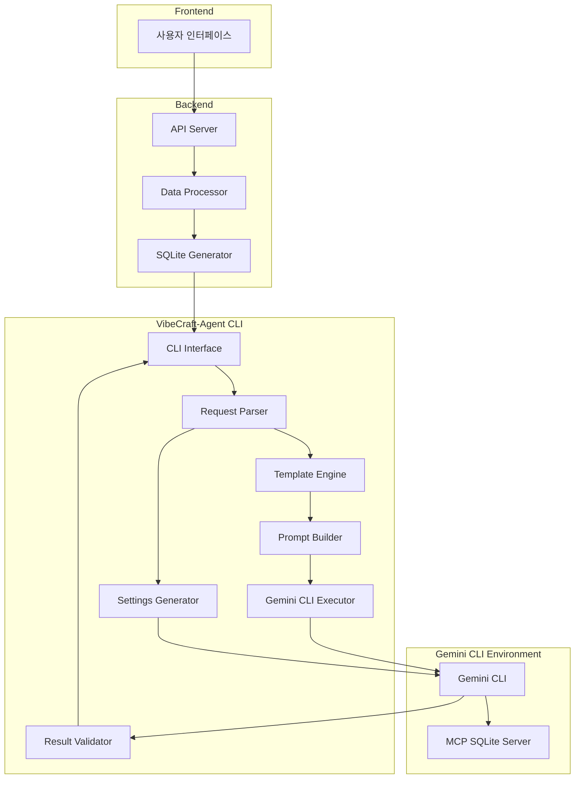
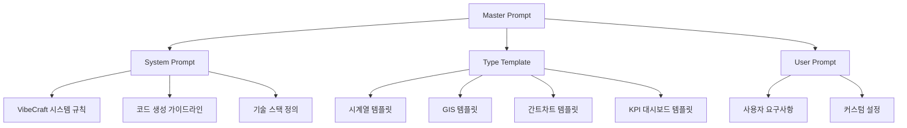

# VibeCraft-Agent: Gemini CLI 기반 데이터 시각화 에이전트 시스템

## 목차
1. [개요](#1-개요)
2. [시스템 아키텍처](#2-시스템-아키텍처)
3. [프롬프트 템플릿 시스템](#3-프롬프트-템플릿-시스템)
4. [MCP SQLite 설정](#4-mcp-sqlite-설정)
5. [에이전트 워크플로우](#5-에이전트-워크플로우)
6. [프롬프트 엔지니어링](#6-프롬프트-엔지니어링)
7. [구현 가이드](#7-구현-가이드)

## 1. 개요

### 1.1 프로젝트 목적
VibeCraft-Agent는 백엔드로부터 SQLite 데이터베이스와 시각화 요청을 받아 Gemini CLI를 통해 React 기반 데이터 시각화 애플리케이션을 자동 생성하는 CLI 도구입니다.

### 1.2 핵심 요구사항
- **백엔드 연동**: SQLite 파일 경로, 사용자 프롬프트, 시각화 타입을 입력으로 받음
- **프롬프트 템플릿 활용**: 시스템/타입별/사용자 프롬프트 조합
- **MCP 동적 구성**: settings.json을 통한 SQLite MCP 서버 설정
- **SQLite 전용**: CSV/JSON 등의 로우 파일 미지원
- **로컬 실행**: 로컬 환경에서 CLI로 실행

### 1.3 에이전트의 역할
- 백엔드에서 전달받은 데이터와 요청을 분석
- 적절한 프롬프트 템플릿 선택 및 조합
- Gemini CLI를 위한 settings.json 설정 생성
- 생성된 React 애플리케이션 검증 및 전달

## 2. 시스템 아키텍처

### 2.1 전체 구조



### 2.2 CLI 인터페이스

```bash
# 기본 사용법
vibecraft-agent \
  --sqlite-path /path/to/data.sqlite \
  --visualization-type time-series \
  --user-prompt "월별 매출 추이를 보여주는 대시보드" \
  --output-dir ./output

# 옵션 설명
--sqlite-path    : SQLite 데이터베이스 파일 경로 (필수)
--visualization-type : 시각화 타입 (필수)
--user-prompt    : 사용자의 시각화 요청 (필수)
--output-dir     : 생성된 React 앱 출력 디렉토리 (기본: ./output)
--project-name   : 프로젝트 이름 (선택)
--debug          : 디버그 모드 활성화 (선택)
```

### 2.3 데이터 플로우

```typescript
interface AgentCliArgs {
  sqlitePath: string;           // SQLite 파일 경로
  visualizationType: VisualizationType;
  userPrompt: string;           // 사용자 시각화 요청
  outputDir: string;            // 출력 디렉토리
  projectName?: string;         // 프로젝트 이름
  debug?: boolean;              // 디버그 모드
}

interface AgentExecutionResult {
  success: boolean;
  outputPath: string;
  executionTime: number;
  logs: string[];
  error?: string;
}

type VisualizationType = 
  | 'time-series'
  | 'geo-spatial'
  | 'gantt-chart'
  | 'kpi-dashboard'
  | 'comparison'
  | 'funnel-analysis'
  | 'cohort-analysis'
  | 'heatmap'
  | 'network-graph'
  | 'custom';
```

## 3. 프롬프트 템플릿 시스템

### 3.1 템플릿 계층 구조



### 3.2 시스템 프롬프트 템플릿

```typescript
const SYSTEM_PROMPT_TEMPLATE = `
You are VibeCraft-viz, a specialized agent for creating data visualization React applications.

## Core Rules:
1. Always create a complete, runnable React application
2. Use sql.js for browser-based SQLite access
3. Include all necessary dependencies in package.json
4. Implement responsive design with Tailwind CSS
5. Add proper error handling and loading states

## Technical Stack:
- React 18.x
- TypeScript (optional based on user preference)
- Recharts/Chart.js for visualizations
- sql.js for SQLite operations
- Tailwind CSS for styling
- {{additionalLibraries}}

## Project Structure:
\`\`\`
├── package.json
├── public/
│   ├── index.html
│   └── data.sqlite
├── src/
│   ├── App.tsx
│   ├── components/
│   ├── hooks/
│   ├── utils/
│   └── types/
└── README.md
\`\`\`

## Data Access Pattern:
Always use the provided SQLite database through sql.js:
\`\`\`javascript
import initSqlJs from 'sql.js';

const loadDatabase = async () => {
  const sqlPromise = initSqlJs({
    locateFile: file => \`https://sql.js.org/dist/\${file}\`
  });
  const dataPromise = fetch('/data.sqlite').then(res => res.arrayBuffer());
  const [SQL, buf] = await Promise.all([sqlPromise, dataPromise]);
  return new SQL.Database(new Uint8Array(buf));
};
\`\`\`
`;
```

### 3.3 시각화 타입별 템플릿

#### 3.3.1 시계열 분석 템플릿

```typescript
const TIME_SERIES_TEMPLATE = `
## Visualization Type: Time Series Analysis

### Required Components:
1. **TimeSeriesChart**: Main line/area chart component
   - Props: data, dateRange, metrics, onRangeChange
   - Features: Zoom, pan, tooltip, export

2. **DateRangePicker**: Time period selector
   - Presets: Last 7 days, 30 days, 90 days, 1 year, custom
   - Props: value, onChange, presets

3. **MetricSelector**: Choose which metrics to display
   - Multi-select capability
   - Props: available, selected, onChange

4. **TrendIndicator**: Show trend direction and percentage
   - Props: current, previous, format

### Data Processing:
\`\`\`javascript
const processTimeSeriesData = (db, dateRange, metrics) => {
  const query = \`
    SELECT 
      date({{timeColumn}}) as date,
      {{metricColumns}}
    FROM {{tableName}}
    WHERE date({{timeColumn}}) BETWEEN ? AND ?
    GROUP BY date({{timeColumn}})
    ORDER BY date({{timeColumn}})
  \`;
  
  const stmt = db.prepare(query);
  stmt.bind([dateRange.start, dateRange.end]);
  
  const results = [];
  while (stmt.step()) {
    results.push(stmt.getAsObject());
  }
  stmt.free();
  
  return results;
};
\`\`\`

### Chart Configuration:
- Use Recharts LineChart for time series
- Enable area fill for better visualization
- Add reference lines for averages
- Implement brush for zoom functionality
`;
```

### 3.4 프롬프트 조합 엔진

```typescript
class PromptBuilder {
  private systemPrompt: string;
  private typeTemplates: Map<VisualizationType, string>;
  
  constructor() {
    this.systemPrompt = SYSTEM_PROMPT_TEMPLATE;
    this.typeTemplates = new Map([
      ['time-series', TIME_SERIES_TEMPLATE],
      ['geo-spatial', GEO_SPATIAL_TEMPLATE],
      // ... 다른 템플릿들
    ]);
  }
  
  buildPrompt(args: AgentCliArgs, schemaInfo: SchemaInfo): string {
    const typeTemplate = this.typeTemplates.get(args.visualizationType) || '';
    
    // 프롬프트 조합
    const finalPrompt = `
${this.systemPrompt}

## Database Information:
- SQLite Path: /data.sqlite (will be copied to public/)
- Tables: ${schemaInfo.tables.join(', ')}
- Schema:
${this.formatSchema(schemaInfo)}

${typeTemplate}

## User Requirements:
${args.userPrompt}

## Additional Instructions:
- The SQLite database is already created and available
- Copy this database to the public/ directory of the React app
- Ensure all queries work with the actual schema
- Create a fully functional application that can be run immediately
- Output all files to the current directory

Now, please generate the complete React application code.
`;
    
    return finalPrompt;
  }
}
```

## 4. MCP SQLite 설정

### 4.1 Gemini CLI settings.json 구성

Gemini CLI는 `~/.gemini/settings.json` 또는 프로젝트 루트의 `.gemini/settings.json`에서 MCP 서버 설정을 읽습니다.

```typescript
class SettingsGenerator {
  private workspaceDir: string;
  
  constructor(workspaceDir: string) {
    this.workspaceDir = workspaceDir;
  }
  
  async generateSettings(sqlitePath: string): Promise<string> {
    const settingsDir = path.join(this.workspaceDir, '.gemini');
    await fs.mkdir(settingsDir, { recursive: true });
    
    const settings = {
      mcpServers: {
        sqlite: {
          command: "uv",
          args: [
            "--directory",
            "/path/to/mcp-server-sqlite",  // 실제 MCP 서버 경로
            "run",
            "mcp-server-sqlite",
            "--db-path",
            path.resolve(sqlitePath)
          ],
          timeout: 30000,
          trust: true  // 로컬 실행이므로 trust 설정
        }
      }
    };
    
    const settingsPath = path.join(settingsDir, 'settings.json');
    await fs.writeFile(settingsPath, JSON.stringify(settings, null, 2));
    
    return settingsPath;
  }
}
```

### 4.2 MCP 서버 설정 예시

```json
{
  "mcpServers": {
    "sqlite": {
      "command": "python",
      "args": [
        "-m",
        "mcp_server_sqlite",
        "--db-path",
        "/absolute/path/to/data.sqlite"
      ],
      "timeout": 30000,
      "trust": true,
      "includeTools": ["read_query", "write_query", "list_tables", "describe_table"]
    }
  }
}
```

## 5. 에이전트 워크플로우

### 5.1 CLI 실행 플로우

```typescript
class VibeCraftAgent {
  private promptBuilder: PromptBuilder;
  private settingsGenerator: SettingsGenerator;
  private schemaExtractor: SchemaExtractor;
  
  async execute(args: AgentCliArgs): Promise<AgentExecutionResult> {
    const startTime = Date.now();
    const logs: string[] = [];
    
    try {
      // 1. 입력 검증
      logs.push('Validating inputs...');
      this.validateArgs(args);
      
      // 2. 작업 디렉토리 생성
      logs.push('Creating workspace...');
      const workspaceDir = await this.createWorkspace(args.outputDir);
      
      // 3. SQLite 스키마 추출
      logs.push('Extracting database schema...');
      const schemaInfo = await this.schemaExtractor.extract(args.sqlitePath);
      
      // 4. Settings 파일 생성
      logs.push('Generating Gemini CLI settings...');
      await this.settingsGenerator.generateSettings(args.sqlitePath);
      
      // 5. 프롬프트 생성
      logs.push('Building visualization prompt...');
      const prompt = this.promptBuilder.buildPrompt(args, schemaInfo);
      
      // 6. 프롬프트 파일 저장
      const promptPath = path.join(workspaceDir, 'prompt.txt');
      await fs.writeFile(promptPath, prompt);
      
      // 7. Gemini CLI 실행
      logs.push('Executing Gemini CLI...');
      await this.executeGeminiCli(workspaceDir, promptPath);
      
      // 8. SQLite 파일 복사
      logs.push('Copying SQLite database...');
      await this.copySqliteToOutput(args.sqlitePath, workspaceDir);
      
      // 9. 결과 검증
      logs.push('Validating output...');
      await this.validateOutput(workspaceDir);
      
      return {
        success: true,
        outputPath: workspaceDir,
        executionTime: Date.now() - startTime,
        logs
      };
      
    } catch (error) {
      logs.push(`Error: ${error.message}`);
      
      return {
        success: false,
        outputPath: args.outputDir,
        executionTime: Date.now() - startTime,
        logs,
        error: error.message
      };
    }
  }
  
  private async executeGeminiCli(
    workspaceDir: string,
    promptPath: string
  ): Promise<void> {
    const command = 'gemini';
    const args = [
      '-p', `@${promptPath}`,
      '--working-directory', workspaceDir
    ];
    
    const result = await execAsync(command, args, {
      cwd: workspaceDir,
      env: {
        ...process.env,
        GEMINI_SETTINGS_DIR: path.join(workspaceDir, '.gemini')
      }
    });
    
    if (result.code !== 0) {
      throw new Error(`Gemini CLI failed: ${result.stderr}`);
    }
  }
}
```

### 5.2 스키마 추출

```typescript
class SchemaExtractor {
  async extract(sqlitePath: string): Promise<SchemaInfo> {
    const db = new Database(sqlitePath, { readonly: true });
    
    try {
      // 테이블 목록 가져오기
      const tables = db.prepare(`
        SELECT name FROM sqlite_master 
        WHERE type='table' AND name NOT LIKE 'sqlite_%'
      `).all().map(row => row.name);
      
      // 각 테이블의 스키마 정보
      const schema: Record<string, ColumnInfo[]> = {};
      
      for (const table of tables) {
        const columns = db.prepare(`
          PRAGMA table_info(${table})
        `).all();
        
        schema[table] = columns.map(col => ({
          name: col.name,
          type: col.type,
          nullable: !col.notnull,
          primaryKey: col.pk === 1
        }));
      }
      
      return { tables, schema };
      
    } finally {
      db.close();
    }
  }
}
```

## 6. 프롬프트 엔지니어링

### 6.1 효과적인 프롬프트 구성

```typescript
interface PromptStrategy {
  // 1. 명확한 제약사항 정의
  constraints: {
    outputLocation: 'current directory';
    dependencies: 'all in package.json';
    dataAccess: 'sql.js only';
  };
  
  // 2. 구체적인 예시 제공
  examples: {
    queryPattern: string;
    componentStructure: string;
    errorHandling: string;
  };
  
  // 3. 검증 가능한 체크리스트
  checklist: string[];
}
```

### 6.2 프롬프트 최적화

```typescript
class PromptOptimizer {
  optimize(basePrompt: string, context: Context): string {
    let optimized = basePrompt;
    
    // 1. 스키마 정보를 구체적으로 포함
    optimized = this.injectSchemaDetails(optimized, context.schema);
    
    // 2. 실제 SQL 쿼리 예시 추가
    optimized = this.addQueryExamples(optimized, context.schema);
    
    // 3. 컴포넌트 import 경로 명시
    optimized = this.clarifyImportPaths(optimized);
    
    // 4. 파일 생성 위치 강조
    optimized = this.emphasizeFileLocations(optimized);
    
    return optimized;
  }
}
```

## 7. 구현 가이드

### 7.1 프로젝트 구조

```
vibecraft-agent/
├── src/
│   ├── cli.ts              # CLI 진입점
│   ├── agent.ts            # 메인 에이전트 클래스
│   ├── templates/          # 프롬프트 템플릿
│   │   ├── system.ts
│   │   ├── time-series.ts
│   │   ├── geo-spatial.ts
│   │   └── ...
│   ├── settings/           # Settings 생성
│   │   └── generator.ts
│   ├── schema/             # 스키마 추출
│   │   └── extractor.ts
│   └── utils/              # 유틸리티
├── package.json
├── tsconfig.json
└── README.md
```

### 7.2 CLI 구현

```typescript
// src/cli.ts
#!/usr/bin/env node

import { Command } from 'commander';
import { VibeCraftAgent } from './agent';

const program = new Command();

program
  .name('vibecraft-agent')
  .description('Generate React data visualization apps using Gemini CLI')
  .version('1.0.0')
  .requiredOption('--sqlite-path <path>', 'Path to SQLite database')
  .requiredOption('--visualization-type <type>', 'Type of visualization')
  .requiredOption('--user-prompt <prompt>', 'User visualization request')
  .option('--output-dir <dir>', 'Output directory', './output')
  .option('--project-name <name>', 'Project name')
  .option('--debug', 'Enable debug mode', false)
  .action(async (options) => {
    const agent = new VibeCraftAgent();
    const result = await agent.execute(options);
    
    if (result.success) {
      console.log(`✅ React app generated successfully!`);
      console.log(`📁 Location: ${result.outputPath}`);
      console.log(`\nNext steps:`);
      console.log(`cd ${result.outputPath}`);
      console.log(`npm install`);
      console.log(`npm start`);
    } else {
      console.error(`❌ Generation failed: ${result.error}`);
      if (options.debug) {
        console.log('\nDebug logs:');
        result.logs.forEach(log => console.log(log));
      }
      process.exit(1);
    }
  });

program.parse();
```

### 7.3 로컬 개발 환경 설정

```bash
# 1. 프로젝트 설치
git clone https://github.com/your-org/vibecraft-agent
cd vibecraft-agent
npm install

# 2. MCP SQLite 서버 설치 (별도)
git clone https://github.com/modelcontextprotocol/servers
cd servers/sqlite
pip install -e .

# 3. 환경 변수 설정
export MCP_SERVER_PATH="/path/to/mcp-server-sqlite"

# 4. 빌드
npm run build

# 5. 로컬 테스트
npm link
vibecraft-agent --help
```

### 7.4 사용 예시

```bash
# 시계열 대시보드 생성
vibecraft-agent \
  --sqlite-path ./sales_data.sqlite \
  --visualization-type time-series \
  --user-prompt "월별 매출 추이와 전년 대비 성장률을 보여주는 대시보드" \
  --output-dir ./sales-dashboard

# GIS 기반 시각화
vibecraft-agent \
  --sqlite-path ./store_locations.sqlite \
  --visualization-type geo-spatial \
  --user-prompt "매장별 매출을 지도에 히트맵으로 표시하고 지역별 통계 제공" \
  --output-dir ./store-map

# 간트 차트
vibecraft-agent \
  --sqlite-path ./project_tasks.sqlite \
  --visualization-type gantt-chart \
  --user-prompt "프로젝트 일정을 담당자별로 구분하고 진행률 표시" \
  --output-dir ./project-gantt \
  --project-name "Project Timeline"
```

### 7.5 에러 처리

```typescript
class ErrorHandler {
  handleError(error: Error, context: ExecutionContext): ErrorAction {
    // Gemini CLI 관련 에러
    if (error.message.includes('gemini: command not found')) {
      return {
        message: 'Gemini CLI is not installed. Please install it first.',
        suggestion: 'npm install -g @google/gemini-cli'
      };
    }
    
    // MCP 서버 에러
    if (error.message.includes('MCP server connection failed')) {
      return {
        message: 'Failed to connect to MCP SQLite server',
        suggestion: 'Check if MCP_SERVER_PATH is correctly set'
      };
    }
    
    // SQLite 파일 에러
    if (error.message.includes('SQLITE_CANTOPEN')) {
      return {
        message: 'Cannot open SQLite database',
        suggestion: 'Verify the SQLite file path and permissions'
      };
    }
    
    // 기본 에러
    return {
      message: error.message,
      suggestion: 'Run with --debug flag for more information'
    };
  }
}
```

## 결론

VibeCraft-Agent는 Gemini CLI의 강력한 코드 생성 능력과 MCP SQLite 서버를 활용하여 데이터 시각화 애플리케이션을 자동으로 생성하는 CLI 도구입니다.

주요 특징:
- **CLI 기반 실행**: 로컬 환경에서 간단한 명령어로 실행
- **Gemini CLI 통합**: settings.json을 통한 MCP 서버 설정
- **템플릿 시스템**: 재사용 가능한 시각화 패턴
- **SQLite 전용**: 백엔드가 제공하는 SQLite 파일 직접 활용