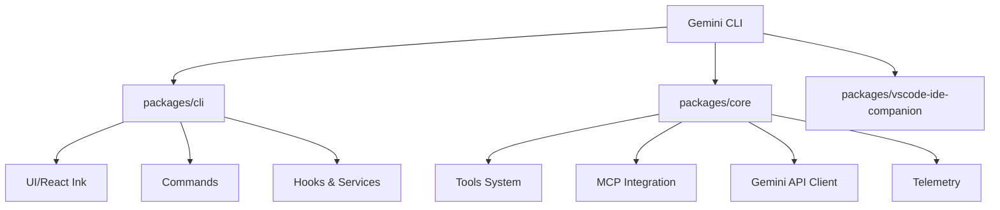
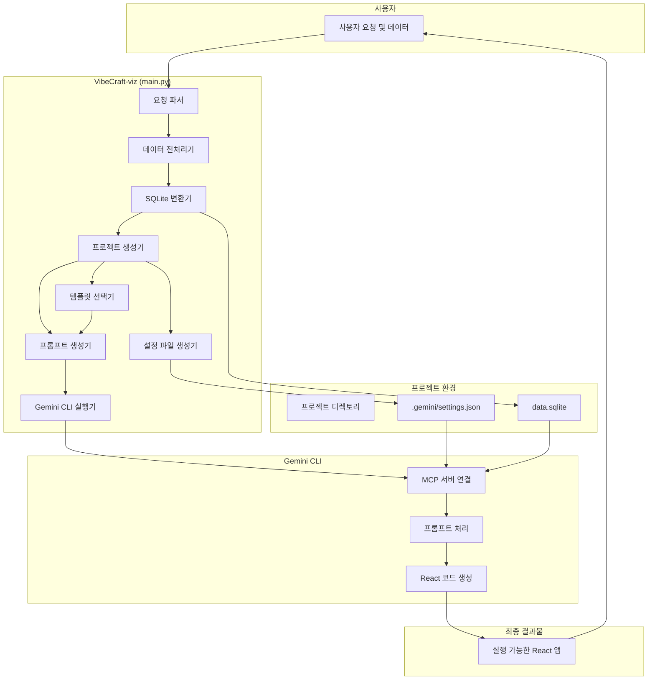
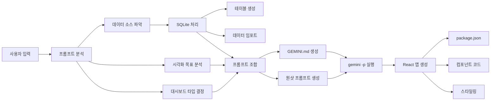
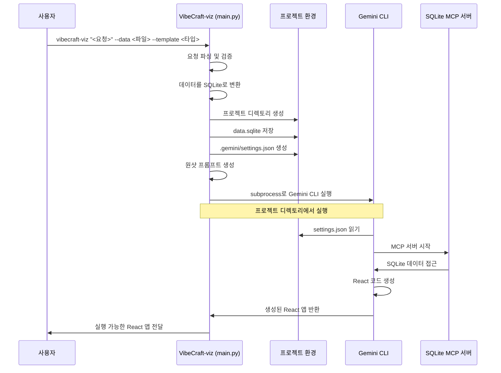
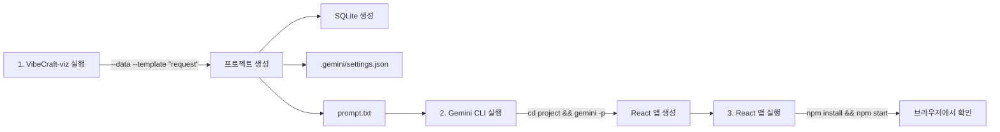

# Gemini CLI를 활용한 데이터 시각화 React 애플리케이션 생성 에이전트 구축 보고서

## 목차
1. [개요](#1-개요)
2. [Gemini CLI 분석](#2-gemini-cli-분석)
3. [데이터 시각화 에이전트 아키텍처](#3-데이터-시각화-에이전트-아키텍처)
4. [원샷 프롬프트 아키텍처](#4-원샷-프롬프트-아키텍처)
5. [구현 전략](#5-구현-전략)
6. [활용 시나리오](#6-활용-시나리오)
7. [권장사항](#7-권장사항)

## 1. 개요

### 1.1 프로젝트 목적
Gemini CLI를 활용하여 데이터 시각화 React 애플리케이션을 자동으로 생성하는 원샷 프롬프트 기반 에이전트를 구축하고자 함.

### 1.2 핵심 요구사항
- 사용자의 자연어 요청을 통한 React 애플리케이션 생성
- SQLite MCP 서버를 통한 데이터 처리
- sql.js를 활용한 브라우저 내 SQLite 실행
- 실행 가능한 React 프로젝트 구조 생성
- 다양한 시각화 템플릿 제공
- **원샷 프롬프트로 완전한 애플리케이션 생성 (gemini -p 옵션 활용)**

## 2. Gemini CLI 분석

### 2.1 프로젝트 구조


```mermaid
graph TD
    A[Gemini CLI] --> B[packages/cli]
    A --> C[packages/core]
    A --> D[packages/vscode-ide-companion]
    
    B --> B1[UI/React Ink]
    B --> B2[Commands]
    B --> B3[Hooks & Services]
    
    C --> C1[Tools System]
    C --> C2[MCP Integration]
    C --> C3[Gemini API Client]
    C --> C4[Telemetry]
```

### 2.2 핵심 기능 분석

#### 2.2.1 도구 시스템 (Tools System)
- **파일 시스템 도구**: 파일 읽기/쓰기, 디렉토리 탐색, 패턴 검색
- **실행 도구**: 쉘 명령어 실행
- **웹 도구**: URL 컨텐츠 가져오기, 웹 검색
- **메모리 도구**: 세션 간 정보 저장 및 검색

#### 2.2.2 MCP (Model Context Protocol) 서버
- 외부 도구 및 서비스 통합을 위한 프로토콜
- Stdio, SSE, HTTP 트랜스포트 지원
- 동적 도구 발견 및 등록
- 신뢰 기반 실행 관리
- **SQLite MCP 서버 통합으로 데이터베이스 작업 수행**

#### 2.2.3 멀티모달 기능
- PDF, 이미지 등 다양한 입력 형식 지원
- 1M 토큰 컨텍스트 윈도우
- Google Search 도구 내장

### 2.3 기술 스택
- **프론트엔드**: React (Ink - CLI UI 라이브러리)
- **백엔드**: Node.js (TypeScript)
- **빌드**: ESBuild
- **패키지 관리**: NPM Workspaces

## 3. 시스템 아키텍처

### 3.1 전체 구조


```mermaid
graph TB
    subgraph "사용자"
        A[사용자 요청 및 데이터]
    end
    
    subgraph "VibeCraft-viz (main.py)"
        B[요청 파서]
        C[데이터 전처리기]
        D[SQLite 변환기]
        E[프로젝트 생성기]
        F[템플릿 선택기]
        G[프롬프트 생성기]
        H[설정 파일 생성기]
        I[Gemini CLI 실행기]
    end
    
    subgraph "프로젝트 환경"
        J[프로젝트 디렉토리]
        K[.gemini/settings.json]
        L[data.sqlite]
    end
    
    subgraph "Gemini CLI"
        M[MCP 서버 연결]
        N[프롬프트 처리]
        O[React 코드 생성]
    end
    
    subgraph "최종 결과물"
        P[실행 가능한 React 앱]
    end
    
    A --> B
    B --> C
    C --> D
    D --> E
    E --> F
    E --> G
    E --> H
    F --> G
    G --> I
    H --> K
    D --> L
    I --> M
    K --> M
    L --> M
    M --> N
    N --> O
    O --> P
    P --> A
```

### 3.2 핵심 컴포넌트

#### 3.2.1 SQLite MCP 서버 통합
- 기존 SQLite MCP 서버 활용 (modelcontextprotocol/servers-archived)
- 데이터베이스 작업 도구 제공:
  - `read_query`: SELECT 쿼리 실행
  - `write_query`: INSERT/UPDATE/DELETE 작업
  - `create_table`: 테이블 생성
  - `list_tables`: 테이블 목록 조회
  - `describe_table`: 스키마 정보 확인

#### 3.2.2 데이터 처리 엔진
- CSV/JSON 파일 파싱 및 검증
- 자동 데이터 타입 추론
- SQLite 테이블 스키마 생성
- 데이터 일괄 임포트

#### 3.2.3 프롬프트 템플릿 시스템
- 대시보드 타입별 템플릿 관리
- 시각화 목적별 특화 템플릿
- React 컴포넌트 구조 템플릿
- 동적 프롬프트 조합

#### 3.2.4 React 앱 생성 엔진
- 완전한 React 프로젝트 구조 생성
- 컴포넌트 기반 아키텍처
- sql.js 통합 코드 자동 생성
- Chart.js/Recharts 설정 코드 생성
- 반응형 디자인 적용

## 4. 원샷 프롬프트 아키텍처

### 4.1 원샷 프롬프트 워크플로우


```mermaid
graph LR
    A[사용자 입력] --> B[프롬프트 분석]
    B --> B1[데이터 소스 파악]
    B --> B2[시각화 목표 분석]
    B --> B3[대시보드 타입 결정]
    
    B1 --> C[SQLite 처리]
    C --> C1[테이블 생성]
    C --> C2[데이터 임포트]
    
    B2 --> D[프롬프트 조합]
    B3 --> D
    C --> D
    
    D --> E[GEMINI.md 생성]
    D --> F[원샷 프롬프트 생성]
    
    E --> G[gemini -p 실행]
    F --> G
    
    G --> H[React 앱 생성]
    H --> H1[package.json]
    H --> H2[컴포넌트 코드]
    H --> H3[스타일링]
```

### 4.2 프롬프트 구조 정의

#### 4.2.1 원샷 프롬프트 구조
```typescript
interface OnehotPromptStructure {
  // 필수 요소
  dataSource: {
    file: string;                      // 데이터 파일 경로
    format: 'csv' | 'json' | 'sqlite'; // 데이터 형식
    description?: string;              // 데이터 설명
  };
  
  // 시각화 목표
  visualizationGoal: {
    type: DashboardType;               // 대시보드 유형
    description: string;               // 자연어 설명
    metrics?: string[];                // 주요 지표
  };
  
  // 선택적 상세 설정
  advanced?: {
    filters?: string[];                // 필터링 옵션
    timeRange?: string;                // 시간 범위
    groupBy?: string[];                // 그룹화 기준
    customRequirements?: string;       // 사용자 정의 요구사항
  };
}

type DashboardType = 
  | 'time-series'          // 시계열 분석
  | 'geo-spatial'          // GIS 기반 지도
  | 'gantt-chart'          // 간트 차트
  | 'kpi-dashboard'        // KPI 대시보드
  | 'comparison'           // 비교 분석
  | 'funnel-analysis'      // 퍼널 분석
  | 'cohort-analysis'      // 코호트 분석
  | 'heatmap'              // 히트맵 분석
  | 'network-graph'        // 네트워크 그래프
  | 'custom';              // 사용자 정의
```

#### 4.2.2 프롬프트 파싱 로직
```typescript
class PromptParser {
  parse(userPrompt: string): OnehotPromptStructure {
    // 1. 데이터 소스 추출
    const dataSource = this.extractDataSource(userPrompt);
    
    // 2. 시각화 목표 분석
    const visualizationGoal = this.analyzeVisualizationGoal(userPrompt);
    
    // 3. 대시보드 타입 결정
    const dashboardType = this.determineDashboardType(userPrompt, dataSource);
    
    // 4. 고급 옵션 추출
    const advanced = this.extractAdvancedOptions(userPrompt);
    
    return {
      dataSource,
      visualizationGoal: {
        ...visualizationGoal,
        type: dashboardType
      },
      advanced
    };
  }
  
  private determineDashboardType(prompt: string, data: any): DashboardType {
    // 키워드 기반 타입 결정
    const typeKeywords = {
      'time-series': ['시간', '추이', '트렌드', '변화', '일별', '월별'],
      'geo-spatial': ['지도', '위치', '지역', '좌표', 'GPS', '지리'],
      'gantt-chart': ['일정', '프로젝트', '타임라인', '진행', '계획'],
      'kpi-dashboard': ['KPI', '지표', '성과', '목표', '달성률'],
      'comparison': ['비교', '대비', 'vs', '차이', '분석'],
      'funnel-analysis': ['퍼널', '전환', '단계', '이탈', '프로세스'],
      'cohort-analysis': ['코호트', '그룹', '세대', '유지율'],
      'heatmap': ['히트맵', '밀도', '분포', '집중도'],
      'network-graph': ['네트워크', '관계', '연결', '노드', '그래프']
    };
    
    // 매칭 로직
    for (const [type, keywords] of Object.entries(typeKeywords)) {
      if (keywords.some(keyword => prompt.includes(keyword))) {
        return type as DashboardType;
      }
    }
    
    return 'custom';
  }
}
```

### 4.3 템플릿 시스템

#### 4.3.1 대시보드 템플릿 구조
```typescript
interface DashboardTemplate {
  id: string;
  name: string;
  description: string;
  requiredDataFields: DataFieldRequirement[];
  defaultCharts: ChartConfig[];
  layoutStructure: LayoutConfig;
  interactiveFeatures: string[];
  reactComponents: ComponentStructure[];
}

interface DataFieldRequirement {
  name: string;
  type: 'date' | 'number' | 'string' | 'boolean' | 'geo';
  required: boolean;
  description: string;
}

interface ChartConfig {
  type: string;
  dataMapping: Record<string, string>;
  options: any;
}

interface ComponentStructure {
  name: string;
  props: string[];
  children?: ComponentStructure[];
}
```

#### 4.3.2 시계열 분석 템플릿
```typescript
const timeSeriesTemplate: DashboardTemplate = {
  id: 'time-series',
  name: '시계열 분석 대시보드',
  description: '시간에 따른 데이터 변화를 분석하고 트렌드를 파악',
  requiredDataFields: [
    { name: 'timestamp', type: 'date', required: true, description: '시간 정보' },
    { name: 'value', type: 'number', required: true, description: '측정값' },
    { name: 'category', type: 'string', required: false, description: '분류 기준' }
  ],
  defaultCharts: [
    {
      type: 'LineChart',
      dataMapping: { x: 'timestamp', y: 'value', series: 'category' },
      options: { smooth: true, showArea: true }
    },
    {
      type: 'BarChart',
      dataMapping: { x: 'period', y: 'aggregatedValue' },
      options: { stacked: false }
    }
  ],
  layoutStructure: {
    type: 'grid',
    columns: 2,
    rows: 2,
    areas: [
      { name: 'main-chart', span: { columns: 2, rows: 1 } },
      { name: 'summary-stats', span: { columns: 1, rows: 1 } },
      { name: 'trend-analysis', span: { columns: 1, rows: 1 } }
    ]
  },
  interactiveFeatures: ['date-range-picker', 'zoom', 'export'],
  reactComponents: [
    {
      name: 'TimeSeriesDashboard',
      props: ['data', 'dateRange', 'onDateRangeChange'],
      children: [
        { name: 'DateRangePicker', props: ['value', 'onChange'] },
        { name: 'LineChartComponent', props: ['data', 'options'] },
        { name: 'SummaryStats', props: ['data'] },
        { name: 'TrendIndicator', props: ['trend'] }
      ]
    }
  ]
};
```

#### 4.3.3 GIS 기반 지도 템플릿
```typescript
const geoSpatialTemplate: DashboardTemplate = {
  id: 'geo-spatial',
  name: 'GIS 기반 지도 대시보드',
  description: '지리적 데이터를 지도 위에 시각화',
  requiredDataFields: [
    { name: 'latitude', type: 'geo', required: true, description: '위도' },
    { name: 'longitude', type: 'geo', required: true, description: '경도' },
    { name: 'value', type: 'number', required: true, description: '표시값' },
    { name: 'label', type: 'string', required: false, description: '라벨' }
  ],
  defaultCharts: [
    {
      type: 'MapComponent',
      dataMapping: { lat: 'latitude', lng: 'longitude', value: 'value' },
      options: { 
        mapType: 'heatmap',
        center: 'auto',
        zoom: 'auto'
      }
    },
    {
      type: 'MarkerCluster',
      dataMapping: { positions: ['latitude', 'longitude'] },
      options: { clustering: true }
    }
  ],
  layoutStructure: {
    type: 'fullscreen-map',
    overlays: ['controls', 'legend', 'info-panel']
  },
  interactiveFeatures: ['pan', 'zoom', 'marker-click', 'layer-toggle'],
  reactComponents: [
    {
      name: 'GeoSpatialDashboard',
      props: ['data', 'mapConfig'],
      children: [
        { name: 'MapContainer', props: ['center', 'zoom'] },
        { name: 'HeatmapLayer', props: ['data', 'intensity'] },
        { name: 'MarkerLayer', props: ['markers', 'onMarkerClick'] },
        { name: 'MapControls', props: ['onZoom', 'onLayerToggle'] },
        { name: 'InfoPanel', props: ['selectedItem'] }
      ]
    }
  ]
};
```

#### 4.3.4 간트 차트 템플릿
```typescript
const ganttChartTemplate: DashboardTemplate = {
  id: 'gantt-chart',
  name: '프로젝트 간트 차트',
  description: '프로젝트 일정과 진행 상황을 타임라인으로 표시',
  requiredDataFields: [
    { name: 'taskName', type: 'string', required: true, description: '작업명' },
    { name: 'startDate', type: 'date', required: true, description: '시작일' },
    { name: 'endDate', type: 'date', required: true, description: '종료일' },
    { name: 'progress', type: 'number', required: false, description: '진행률' },
    { name: 'assignee', type: 'string', required: false, description: '담당자' },
    { name: 'dependencies', type: 'string', required: false, description: '선행작업' }
  ],
  defaultCharts: [
    {
      type: 'GanttChart',
      dataMapping: {
        task: 'taskName',
        start: 'startDate',
        end: 'endDate',
        progress: 'progress'
      },
      options: {
        showDependencies: true,
        showProgress: true,
        viewMode: 'Day'
      }
    }
  ],
  layoutStructure: {
    type: 'split-view',
    left: { component: 'task-list', width: '30%' },
    right: { component: 'gantt-timeline', width: '70%' }
  },
  interactiveFeatures: ['drag-drop', 'resize-bars', 'dependency-links', 'zoom-timeline'],
  reactComponents: [
    {
      name: 'GanttDashboard',
      props: ['tasks', 'viewMode', 'onTaskUpdate'],
      children: [
        { name: 'TaskList', props: ['tasks', 'onTaskSelect'] },
        { name: 'GanttTimeline', props: ['tasks', 'viewMode'] },
        { name: 'ViewModeSelector', props: ['mode', 'onChange'] },
        { name: 'ProgressIndicator', props: ['overallProgress'] }
      ]
    }
  ]
};
```

### 4.4 프롬프트 생성 엔진

#### 4.4.1 React 프롬프트 생성기
```typescript
class ReactPromptGenerator {
  generatePrompt(
    parsedRequest: OnehotPromptStructure,
    template: DashboardTemplate
  ): string {
    return `
다음 요구사항에 따라 완전한 React 데이터 시각화 애플리케이션을 생성해주세요:

## 프로젝트 구조
Create a complete React application with the following structure:
- package.json (with all dependencies)
- src/App.js (main component)
- src/components/ (visualization components)
- src/utils/ (data processing utilities)
- public/data.sqlite (data file)

## 기술 스택
- React 18.x
- Chart.js or Recharts for visualizations
- sql.js for SQLite in browser
- Tailwind CSS for styling
- ${this.getAdditionalLibraries(template)}

## 데이터 정보
- File: ${parsedRequest.dataSource.file}
- Format: ${parsedRequest.dataSource.format}
- Description: ${parsedRequest.dataSource.description || 'N/A'}

## 시각화 요구사항
- Dashboard Type: ${template.name}
- Goal: ${parsedRequest.visualizationGoal.description}
- Required Features:
${template.interactiveFeatures.map(f => `  - ${f}`).join('\n')}

## 컴포넌트 구조
${this.generateComponentStructure(template.reactComponents)}

## SQL 쿼리
${this.generateSQLQueries(parsedRequest, template)}

## 레이아웃
${this.describeLayout(template.layoutStructure)}

## 상호작용 기능
${template.interactiveFeatures.map(feature => `- ${feature}`).join('\n')}

## 코드 생성 규칙
1. 모든 파일은 즉시 실행 가능해야 함
2. 에러 처리와 로딩 상태 구현
3. 반응형 디자인 적용
4. 주석으로 주요 로직 설명
5. TypeScript 타입 정의 포함 (선택적)

## 사용자 추가 요구사항
${parsedRequest.advanced?.customRequirements || '없음'}

지금 바로 전체 React 애플리케이션 코드를 생성해주세요.
`;
  }
  
  private getAdditionalLibraries(template: DashboardTemplate): string {
    const libraries = {
      'geo-spatial': 'Leaflet for maps',
      'gantt-chart': 'Frappe Gantt or react-gantt',
      'network-graph': 'D3.js or vis.js',
      'heatmap': 'D3.js for advanced heatmaps'
    };
    return libraries[template.id] || '';
  }
  
  private generateComponentStructure(components: ComponentStructure[]): string {
    return components.map(comp => this.formatComponent(comp, 0)).join('\n');
  }
  
  private formatComponent(comp: ComponentStructure, indent: number): string {
    const spacing = '  '.repeat(indent);
    let result = `${spacing}<${comp.name} ${comp.props.map(p => `${p}={...}`).join(' ')}>`;
    
    if (comp.children) {
      result += '\n';
      result += comp.children.map(child => 
        this.formatComponent(child, indent + 1)
      ).join('\n');
      result += `\n${spacing}</${comp.name}>`;
    } else {
      result = result.replace('>', ' />');
    }
    
    return result;
  }
}
```

## 5. 구현 전략

### 5.1 실행 플로우


```mermaid
sequenceDiagram
    participant U as 사용자
    participant V as VibeCraft-viz (main.py)
    participant P as 프로젝트 환경
    participant G as Gemini CLI
    participant S as SQLite MCP 서버
    
    U->>V: vibecraft-viz "<요청>" --data <파일> --template <타입>
    V->>V: 요청 파싱 및 검증
    V->>V: 데이터를 SQLite로 변환
    V->>P: 프로젝트 디렉토리 생성
    V->>P: data.sqlite 저장
    V->>P: .gemini/settings.json 생성
    V->>V: 원샷 프롬프트 생성
    V->>G: subprocess로 Gemini CLI 실행
    Note over V,G: 프로젝트 디렉토리에서 실행
    G->>P: settings.json 읽기
    G->>S: MCP 서버 시작
    S->>G: SQLite 데이터 접근
    G->>G: React 코드 생성
    G->>V: 생성된 React 앱 반환
    V->>U: 실행 가능한 React 앱 전달
```

### 5.2 Gemini CLI MCP 서버 설정

#### 5.2.1 .gemini/settings.json 생성
```typescript
class GeminiSettingsManager {
  async createGeminiSettings(projectId: string, projectPath: string): Promise<void> {
    const geminiDir = path.join(projectPath, '.gemini');
    const dbPath = path.join(projectPath, 'data.sqlite');
    
    // .gemini 디렉토리 생성
    await fs.mkdir(geminiDir, { recursive: true });
    
    // settings.json 생성
    const settings = {
      "mcpServers": {
        "sqlite": {
          "command": "uv",
          "args": [
            "--directory",
            "/path/to/mcp-server-sqlite",  // MCP 서버 루트 디렉토리
            "run",
            "mcp-server-sqlite",
            "--db-path",
            dbPath  // 프로젝트별 SQLite 경로
          ]
        }
      }
    };
    
    // settings.json 저장
    await fs.writeFile(
      path.join(geminiDir, 'settings.json'),
      JSON.stringify(settings, null, 2)
    );
  }
}
```

#### 5.2.2 VibeCraft-viz 메인 실행 로직
```python
import subprocess
import os
import sys
from typing import Dict, Any

class VibeCraftViz:
    def __init__(self):
        self.project_manager = ProjectManager()
        self.data_processor = DataProcessor()
        self.prompt_generator = PromptGenerator()
        self.settings_manager = GeminiSettingsManager()
    
    def process_request(self, user_request: str, data_file: str, template: str) -> Dict[str, Any]:
        """사용자 요청을 처리하고 React 앱을 생성"""
        try:
            # 1. 프로젝트 생성
            project_id, project_path = self.project_manager.create_project()
            print(f"[1/5] 📁 프로젝트 생성: {project_id}")
            
            # 2. 데이터 처리
            data_info = self.data_processor.processDataToSQLite(
                data_file, 
                project_path
            )
            print(f"[2/5] 📊 데이터 처리 완료: {data_info['row_count']} rows")
            
            # 3. MCP 설정 생성
            self.settings_manager.createGeminiSettings(
                project_id, 
                project_path
            )
            print(f"[3/5] ⚙️ Gemini 설정 생성 완료")
            
            # 4. 프롬프트 생성
            prompt = self.prompt_generator.generate(
                user_request=user_request,
                template=template,
                data_info=data_info
            )
            print(f"[4/5] 📝 프롬프트 생성 완료")
            
            # 5. Gemini CLI 실행
            print(f"[5/5] 🚀 Gemini CLI 실행 중...")
            react_app_path = self.execute_gemini_cli(
                project_path, 
                prompt
            )
            
            print(f"\n✅ React 앱이 생성되었습니다!")
            print(f"📂 위치: {react_app_path}")
            print(f"\n실행 방법:")
            print(f"cd {react_app_path}")
            print(f"npm install")
            print(f"npm start")
            
            return {
                "success": True,
                "project_id": project_id,
                "app_path": react_app_path
            }
            
        except Exception as e:
            print(f"\n❌ 오류 발생: {e}")
            return {"success": False, "error": str(e)}
    
    def execute_gemini_cli(self, project_path: str, prompt: str) -> str:
        """Gemini CLI를 subprocess로 실행"""
        # Gemini CLI 명령어 구성
        cmd = [
            "gemini",
            "-p", prompt
        ]
        
        # 프로젝트 디렉토리에서 실행
        result = subprocess.run(
            cmd,
            cwd=project_path,
            capture_output=True,
            text=True
        )
        
        if result.returncode != 0:
            raise Exception(f"Gemini CLI 실행 실패: {result.stderr}")
        
        # 생성된 React 앱 경로 반환
        output_path = os.path.join(project_path, "output")
        return output_path

def main():
    """CLI 진입점"""
    import argparse
    
    parser = argparse.ArgumentParser(description="VibeCraft-viz: React 데이터 시각화 앱 생성기")
    parser.add_argument("request", help="시각화 요청 설명")
    parser.add_argument("--data", required=True, help="데이터 파일 경로")
    parser.add_argument("--template", required=True, help="대시보드 템플릿 타입")
    
    args = parser.parse_args()
    
    # VibeCraft-viz 실행
    viz = VibeCraftViz()
    result = viz.process_request(
        user_request=args.request,
        data_file=args.data,
        template=args.template
    )
    
    sys.exit(0 if result["success"] else 1)

if __name__ == "__main__":
    main()
```

### 5.3 사용자 인터페이스

```bash
# 기본 사용법 - 사용자는 요청만 전달
$ vibecraft-viz "<시각화 요청>" --data <데이터파일> --template <템플릿>

# 실제 사용 예시
$ vibecraft-viz "월별 매출 추이와 전년 대비 성장률을 보여주는 대시보드 만들어줘" \
  --data sales.csv \
  --template time-series

# GIS 대시보드 예시
$ vibecraft-viz "매장별 매출을 지도에 히트맵으로 표시하고 지역별 통계도 보여줘" \
  --data stores.json \
  --template geo-spatial

# 간트 차트 예시
$ vibecraft-viz "프로젝트 일정을 담당자별로 구분하고 진행 상태를 색상으로 표시해줘" \
  --data tasks.csv \
  --template gantt-chart

# 템플릿 자동 선택 (옵션)
$ vibecraft-viz "시간별 웹사이트 트래픽과 전환율을 분석해줘" \
  --data traffic.csv
# VibeCraft-viz가 자동으로 time-series 템플릿 선택

# 사용 가능한 템플릿 목록
time-series       : 시간에 따른 데이터 변화 분석
geo-spatial       : 지리적 데이터 시각화
gantt-chart       : 프로젝트 일정 관리
kpi-dashboard     : 핵심 성과 지표 대시보드
comparison        : 비교 분석 대시보드
funnel-analysis   : 전환 퍼널 분석
cohort-analysis   : 코호트 분석
heatmap          : 히트맵 시각화
network-graph     : 네트워크 관계 시각화
custom           : 사용자 정의
```

### 5.4 주요 컴포넌트 구현

#### 5.4.1 데이터 처리 모듈
```python
import pandas as pd
import sqlite3
import os
import uuid
from datetime import datetime
from typing import Dict, List, Any
import json

class DataProcessor:
    def __init__(self):
        pass
        
    def processDataToSQLite(self, data_path: str, project_path: str) -> Dict[str, Any]:
        """데이터를 SQLite로 변환하여 프로젝트 폴더에 저장"""
        db_path = os.path.join(project_path, "data.sqlite")
        
        # 데이터 형식에 따라 처리
        if data_path.endswith('.csv'):
            result = self._import_csv(data_path, db_path)
        elif data_path.endswith('.json'):
            result = self._import_json(data_path, db_path)
        else:
            raise ValueError(f"Unsupported data format: {data_path}")
        
        return result
        
    def _import_csv(self, csv_path: str, db_path: str) -> Dict[str, Any]:
        """CSV 파일을 SQLite로 임포트"""
        # CSV 읽기
        df = pd.read_csv(csv_path)
        
        # 데이터 타입 추론
        schema = self._infer_schema(df)
        
        # SQLite에 저장
        conn = sqlite3.connect(db_path)
        table_name = 'data_table'
        df.to_sql(table_name, conn, if_exists='replace', index=False)
        conn.close()
        
        return {
            "table_name": table_name,
            "columns": list(df.columns),
            "row_count": len(df),
            "schema": schema,
            "db_path": db_path
        }
    
    def _infer_schema(self, df: pd.DataFrame) -> Dict[str, str]:
        """데이터프레임에서 스키마 추론"""
        type_mapping = {
            'int64': 'INTEGER',
            'float64': 'REAL',
            'object': 'TEXT',
            'datetime64[ns]': 'TEXT',
            'bool': 'INTEGER'
        }
        
        schema = {}
        for col, dtype in df.dtypes.items():
            schema[col] = type_mapping.get(str(dtype), 'TEXT')
        
        return schema


class ProjectManager:
    """프로젝트 생성 및 관리"""
    def __init__(self):
        self.projects_dir = "./projects"
        os.makedirs(self.projects_dir, exist_ok=True)
    
    def create_project(self, name: str = None) -> tuple[str, str]:
        """새 프로젝트 생성 및 ID, 경로 반환"""
        timestamp = datetime.now().strftime("%Y%m%d-%H%M%S")
        project_id = f"{timestamp}-{name or uuid.uuid4().hex[:8]}"
        
        project_dir = os.path.join(self.projects_dir, project_id)
        os.makedirs(project_dir, exist_ok=True)
        
        # 프로젝트 메타데이터 저장
        metadata = {
            "id": project_id,
            "name": name,
            "created_at": datetime.now().isoformat(),
            "status": "active"
        }
        
        with open(os.path.join(project_dir, "metadata.json"), 'w') as f:
            json.dump(metadata, f, indent=2)
        
        return project_id, project_dir


class GeminiSettingsManager:
    """.gemini/settings.json 생성 및 관리"""
    def __init__(self, mcp_server_path: str = "/path/to/mcp-server-sqlite"):
        self.mcp_server_path = mcp_server_path
    
    async def createGeminiSettings(self, project_id: str, project_path: str) -> None:
        """Gemini CLI를 위한 settings.json 생성"""
        gemini_dir = os.path.join(project_path, '.gemini')
        db_path = os.path.join(project_path, 'data.sqlite')
        
        # .gemini 디렉토리 생성
        os.makedirs(gemini_dir, exist_ok=True)
        
        # settings.json 생성
        settings = {
            "mcpServers": {
                "sqlite": {
                    "command": "uv",
                    "args": [
                        "--directory",
                        self.mcp_server_path,
                        "run",
                        "mcp-server-sqlite",
                        "--db-path",
                        db_path
                    ]
                }
            }
        }
        
        # settings.json 저장
        settings_path = os.path.join(gemini_dir, 'settings.json')
        with open(settings_path, 'w') as f:
            json.dump(settings, f, indent=2)
```

#### 5.4.2 프롬프트 생성기
```python
from jinja2 import Template
from typing import Dict, Any
import os

class PromptGenerator:
    def __init__(self, template_dir: str = "./templates"):
        self.template_dir = template_dir
        
    def generate_prompt(self, request: OnehotPromptStructure, template: DashboardTemplate) -> str:
        """요구사항에 따라 React 앱 생성 프롬프트 생성"""
        # 템플릿 로드
        template_path = os.path.join(
            self.template_dir, 
            'dashboards', 
            f'{template.id}.md'
        )
        
        with open(template_path, 'r', encoding='utf-8') as f:
            template_content = f.read()
        
        # SQL 쿼리 생성
        sql_queries = self._generate_sql_queries(request, template)
        
        # React 컴포넌트 구조 생성
        component_structure = self._generate_component_structure(template.reactComponents)
        
        # 템플릿 렌더링
        jinja_template = Template(template_content)
        prompt = jinja_template.render(
            request=request,
            template=template,
            sql_queries=sql_queries,
            component_structure=component_structure,
            libraries=self._get_required_libraries(template)
        )
        
        return prompt
    
    def _generate_sql_queries(self, request: OnehotPromptStructure, template: DashboardTemplate) -> List[str]:
        """대시보드에 필요한 SQL 쿼리들 생성"""
        queries = []
        
        for chart in template.defaultCharts:
            query = self._build_query_for_chart(chart, request.dataSource)
            queries.append(query)
        
        return queries
    
    def _get_required_libraries(self, template: DashboardTemplate) -> Dict[str, str]:
        """템플릿에 필요한 라이브러리 리스트"""
        base_libs = {
            'react': '^18.2.0',
            'react-dom': '^18.2.0',
            'sql.js': '^1.8.0',
            'recharts': '^2.8.0'
        }
        
        # 템플릿별 추가 라이브러리
        if template.id == 'geo-spatial':
            base_libs['leaflet'] = '^1.9.4'
            base_libs['react-leaflet'] = '^4.2.1'
        elif template.id == 'gantt-chart':
            base_libs['frappe-gantt'] = '^0.6.1'
        
        return base_libs
```

### 5.5 프로젝트 출력 구조

```
vibecraft-viz/
├── projects/
│   └── 20240320-143022-sales-dashboard/    # 프로젝트 ID
│       ├── .gemini/                        # Gemini CLI 설정
│       │   └── settings.json               # MCP 서버 설정
│       ├── data.sqlite                     # 프로젝트 데이터
│       ├── metadata.json                   # 프로젝트 메타데이터
│       ├── prompt.txt                      # 생성된 원샷 프롬프트
│       └── output/                         # Gemini CLI가 생성한 React 앱
│           ├── package.json
│           ├── README.md
│           ├── public/
│           │   ├── index.html
│           │   └── data.sqlite (copy)
│           ├── src/
│           │   ├── App.js
│           │   ├── index.js
│           │   ├── components/
│           │   │   ├── Dashboard.js
│           │   │   ├── Charts/
│           │   │   └── Controls/
│           │   └── utils/
│           └── .gitignore
├── templates/                              # 대시보드 템플릿
└── src/                                     # VibeCraft-viz 소스 코드
    └── main.py                             # 진입점
```

## 6. 활용 시나리오

### 6.1 시계열 분석 예시

```bash
# 사용자 실행
$ vibecraft-viz "주가 변동 추이와 거래량을 보여주는 대시보드를 만들어줘. 30일/90일/1년 기간 선택 가능하게 해줘" \
  --data stock_prices.csv \
  --template time-series

# VibeCraft-viz 출력
[1/5] 📁 프로젝트 생성: 20240320-143022-stock-analysis
[2/5] 📊 데이터 처리 완료: 5,234 rows
[3/5] ⚙️ Gemini 설정 생성 완료
[4/5] 📝 프롬프트 생성 완료
[5/5] 🚀 Gemini CLI 실행 중...

✅ React 앱이 생성되었습니다!
📂 위치: ./projects/20240320-143022-stock-analysis/output

실행 방법:
cd ./projects/20240320-143022-stock-analysis/output
npm install
npm start

다음 명령어로 Gemini CLI를 실행하세요:

cd ./projects/20240320-143022-stock-analysis
gemini -p "$(cat prompt.txt)"

# 사용자는 VibeCraft-viz가 모든 것을 처리하므로 기다리기만 하면 됨
```

### 6.2 GIS 대시보드 예시

```bash
# Step 1: VibeCraft-viz 실행
$ vibecraft-viz create --data delivery_data.json --template geo-spatial "배송 지역별 소요 시간을 지도에 히트맵으로 표시하고, 배송 경로도 보여줘"

# VibeCraft-viz 출력
✓ Project Path: ./projects/20240320-143512-delivery-dashboard
✓ 데이터 처리 완료: 1,834 records
✓ GIS 데이터 감지: latitude, longitude 필드 확인
✓ .gemini/settings.json 생성 완료

다음 명령어로 Gemini CLI를 실행하세요:

cd ./projects/20240320-143512-delivery-dashboard
gemini -p "$(cat prompt.txt)"

# Step 2: Gemini CLI 실행 후 생성되는 주요 컴포넌트
- DeliveryMap.js (Leaflet 기반 지도)
- HeatmapLayer.js (배송 시간 히트맵)
- RouteLayer.js (배송 경로 표시)
- DeliveryStats.js (통계 패널)
```

### 6.3 원샷 프롬프트 예시

```bash
# VibeCraft-viz가 생성하는 prompt.txt 파일 내용 예시
$ cat ./projects/20240320-143022-stock-analysis/prompt.txt

다음 요구사항에 따라 완전한 React 데이터 시각화 애플리케이션을 생성해주세요:

## 프로젝트 구조
Create a complete React application with the following structure:
- package.json (with all dependencies)
- src/App.js (main component)
- src/components/ (visualization components)
- src/utils/ (data processing utilities)
- public/data.sqlite (copy from project root)

## 기술 스택
- React 18.x
- Chart.js or Recharts for time-series visualization
- sql.js for SQLite in browser
- Tailwind CSS for styling

## 데이터 정보
- File: data.sqlite (already in project root)
- Table: data_table
- Columns: date, open, high, low, close, volume
- Rows: 5,234

## 시각화 요구사항
- Dashboard Type: 시계열 분석 대시보드
- Goal: 주가 변동 추이와 거래량을 보여주는 대시보드를 만들어줘. 30일/90일/1년 기간 선택 가능하게 해줘
- Required Features:
  - date-range-picker
  - zoom
  - export
  - volume chart
  - price chart with candlestick

## 컴포넌트 구조
<TimeSeriesDashboard data={...} dateRange={...} onDateRangeChange={...}>
  <DateRangePicker value={...} onChange={...} />
  <CandlestickChart data={...} options={...} />
  <VolumeChart data={...} options={...} />
  <SummaryStats data={...} />
  <TrendIndicator trend={...} />
</TimeSeriesDashboard>

## 코드 생성 규칙
1. output/ 디렉토리에 모든 파일 생성
2. 즉시 실행 가능해야 함 (npm install && npm start)
3. SQLite 파일은 public/data.sqlite로 복사
4. 에러 처리와 로딩 상태 구현
5. 반응형 디자인 적용

지금 바로 전체 React 애플리케이션 코드를 생성해주세요.
```

### 6.4 전체 워크플로우 요약


```mermaid
graph LR
    A[1. VibeCraft-viz 실행] -->|--data --template &quot;request&quot;| B[프로젝트 생성]
    B --> C[SQLite 생성]
    B --> D[.gemini/settings.json]
    B --> E[prompt.txt]
    
    E --> F[2. Gemini CLI 실행]
    F -->|cd project && gemini -p| G[React 앱 생성]
    
    G --> H[3. React 앱 실행]
    H -->|npm install && npm start| I[브라우저에서 확인]
```

### 6.5 프로젝트 구조 탐색

```bash
# 생성된 프로젝트 확인
$ ls -la ./projects/20240320-143022-stock-analysis/

drwxr-xr-x  .gemini/
  -rw-r--r--  settings.json    # MCP SQLite 서버 설정
-rw-r--r--  data.sqlite        # 프로젝트 데이터
-rw-r--r--  metadata.json      # 프로젝트 메타데이터
-rw-r--r--  prompt.txt         # 원샷 프롬프트
drwxr-xr-x  output/            # Gemini CLI가 생성한 React 앱

# .gemini/settings.json 내용 확인
$ cat ./projects/20240320-143022-stock-analysis/.gemini/settings.json
{
  "mcpServers": {
    "sqlite": {
      "command": "uv",
      "args": [
        "--directory",
        "/path/to/mcp-server-sqlite",
        "run",
        "mcp-server-sqlite",
        "--db-path",
        "/absolute/path/to/projects/20240320-143022-stock-analysis/data.sqlite"
      ]
    }
  }
}
```

## 7. 권장사항

### 7.1 구현 우선순위

1. **Phase 1: 핵심 기능**
   - 프롬프트 파서 구현
   - 기본 템플릿 3개 (시계열, KPI, 비교)
   - React 프로젝트 생성기

2. **Phase 2: 템플릿 확장**
   - 전체 10개 템플릿 구현
   - 템플릿 커스터마이징 기능
   - 데이터 검증 강화

3. **Phase 3: 사용성 개선**
   - 생성 진행 상황 표시
   - 에러 처리 및 검증 강화
   - 프리뷰 기능

4. **Phase 4: 고급 기능**
   - 실시간 데이터 연동
   - 다중 데이터 소스 지원
   - 커스텀 컴포넌트 주입

### 7.2 성능 최적화

- 대용량 데이터: 가상화 및 페이징 자동 적용
- 번들 크기: 코드 스플리팅 기본 적용
- SQLite 쿼리: 인덱스 자동 생성

### 7.3 보안 고려사항

- SQLite MCP 서버는 읽기 전용 모드로 설정
- 생성된 React 앱의 XSS 방지 (데이터 이스케이핑)
- SQL 인젝션 방지 (파라미터화된 쿼리)
- CORS 정책 고려 (로컬 파일 접근)

### 7.4 사용자 경험

- 명확한 진행 상황 표시
- 상세한 에러 메시지와 해결 방법 제시
- 생성된 프로젝트 실행 가이드
- 브라우저 자동 열기 옵션

### 7.5 확장성

- 새로운 차트 라이브러리 추가 용이
- 프롬프트 템플릿 플러그인 시스템
- 다양한 데이터 형식 지원 확장
- 국제화(i18n) 지원 준비

## 결론

VibeCraft-viz와 Gemini CLI를 통합한 데이터 시각화 React 애플리케이션 생성 시스템은 사용자가 데이터 파일과 자연어 요청만으로 완전한 시각화 애플리케이션을 생성할 수 있는 혁신적인 솔루션입니다.

### 시스템 아키텍처:

1. **VibeCraft-viz (main.py)**:
   - 필수 파라미터 수집 (--data, --template)
   - SQLite 데이터베이스 생성
   - .gemini/settings.json 생성
   - 원샷 프롬프트 조합 및 저장

2. **Gemini CLI**:
   - .gemini/settings.json을 통해 MCP SQLite 서버 연결
   - 원샷 프롬프트를 받아 React 앱 생성
   - output/ 디렉토리에 완전한 프로젝트 구조 생성

### 핵심 차별화 요소:
- **명확한 역할 분리**: VibeCraft-viz는 데이터 처리와 프롬프트 준비, Gemini CLI는 코드 생성
- **표준화된 MCP 설정**: .gemini/settings.json을 통한 표준 MCP 서버 설정
- **원샷 프롬프트 방식**: 모든 정보가 담긴 단일 프롬프트로 Gemini CLI 실행
- **10가지 전문 템플릿**: 다양한 시각화 요구사항에 대응

### 기대 효과:
1. **단순한 사용법**: 필수 파라미터만 지정하면 나머지는 자동화
2. **즉시 실행 가능**: npm install & npm start로 바로 실행
3. **프로젝트별 격리**: 각 프로젝트마다 독립적인 SQLite와 설정
4. **확장 가능한 구조**: 새로운 템플릿과 기능 추가 용이

### 기술적 혁신:
- Gemini CLI의 MCP 프로토콜 활용
- 프로젝트별 .gemini/settings.json 통한 동적 설정
- WebAssembly 기반 브라우저 내 SQLite 실행
- 템플릿 기반 프롬프트 조합 시스템

이 접근 방식은 데이터 시각화의 진입 장벽을 크게 낮추면서도, 전문가 수준의 결과물을 생성할 수 있는 실용적인 솔루션입니다.