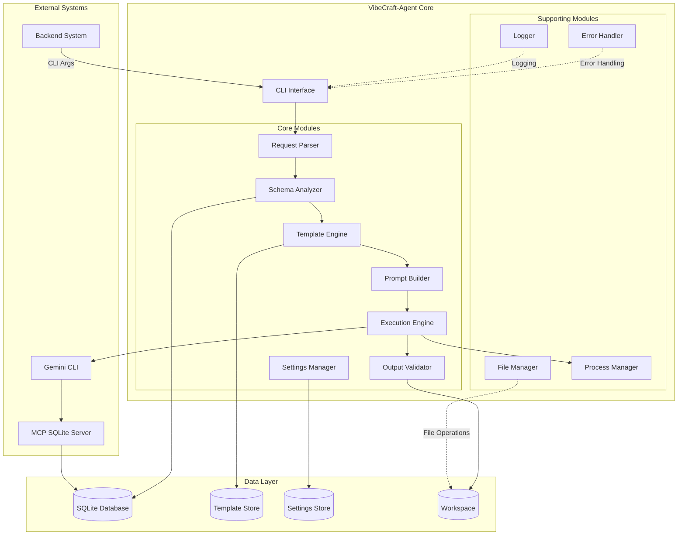
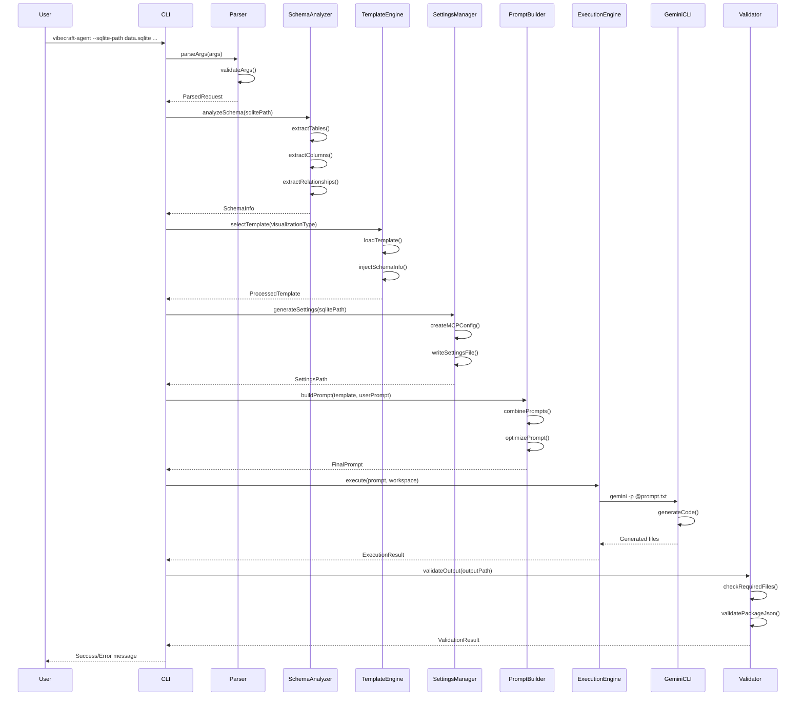
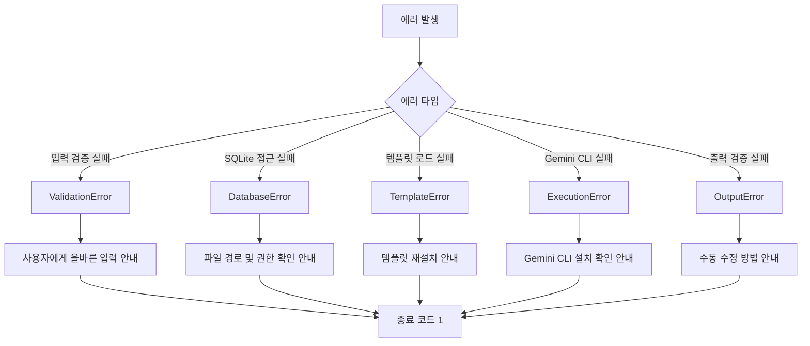
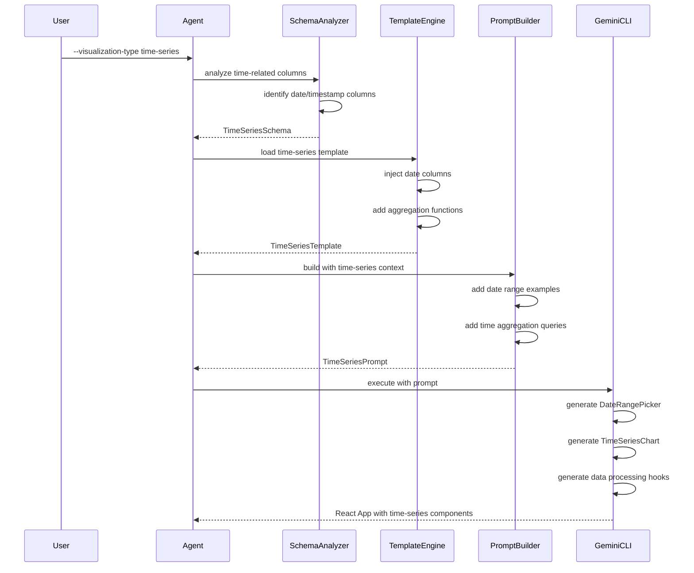
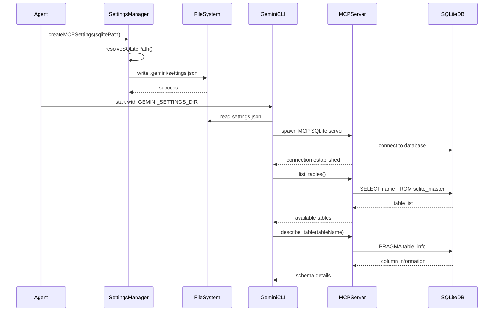
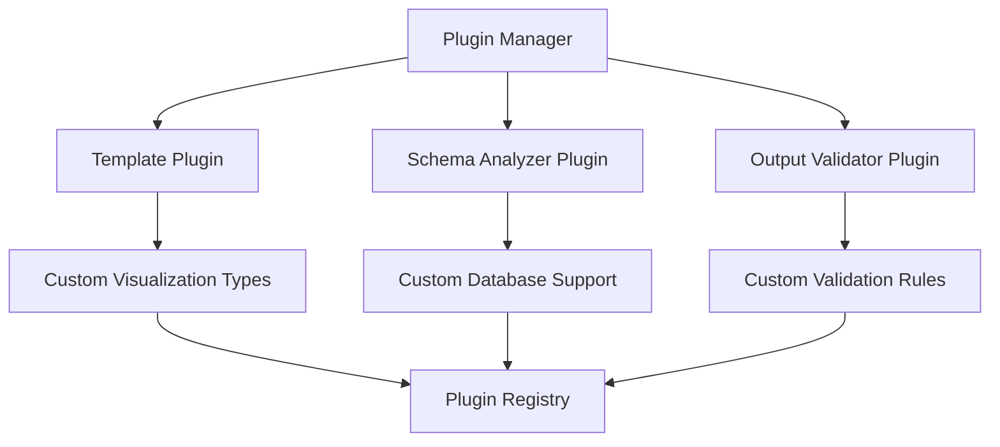

# VibeCraft-Agent 기술 아키텍처 문서

## 1. 시스템 개요

VibeCraft-Agent는 SQLite 데이터베이스를 입력으로 받아 Gemini CLI를 통해 React 기반 데이터 시각화 애플리케이션을 자동 생성하는 CLI 도구입니다.

### 1.1 핵심 아키텍처 원칙

- **모듈화**: 각 컴포넌트는 단일 책임 원칙을 따름
- **확장성**: 새로운 시각화 타입을 쉽게 추가 가능
- **재사용성**: 템플릿과 유틸리티 함수의 재사용
- **테스트 용이성**: 각 모듈의 독립적 테스트 가능

## 2. 시스템 컴포넌트 아키텍처

### 2.1 컴포넌트 다이어그램



### 2.2 컴포넌트 책임 정의

#### 2.2.1 CLI Interface
- **책임**: 명령행 인터페이스 제공 및 입력 검증
- **입력**: 명령행 인자 (SQLite 경로, 시각화 타입, 사용자 프롬프트 등)
- **출력**: 실행 결과 및 생성된 앱 경로

#### 2.2.2 Request Parser
- **책임**: CLI 인자 파싱 및 검증
- **입력**: Raw CLI arguments
- **출력**: Typed request object

#### 2.2.3 Schema Analyzer
- **책임**: SQLite 데이터베이스 스키마 분석
- **입력**: SQLite 파일 경로
- **출력**: 테이블 구조, 컬럼 정보, 관계 정보

#### 2.2.4 Template Engine
- **책임**: 시각화 타입에 따른 템플릿 선택 및 렌더링
- **입력**: 시각화 타입, 스키마 정보
- **출력**: 렌더링된 템플릿

#### 2.2.5 Settings Manager
- **책임**: Gemini CLI settings.json 생성 및 관리
- **입력**: SQLite 경로, MCP 서버 설정
- **출력**: settings.json 파일

#### 2.2.6 Prompt Builder
- **책임**: 최종 프롬프트 조합 및 최적화
- **입력**: 시스템 프롬프트, 타입 템플릿, 사용자 프롬프트
- **출력**: 최종 프롬프트 문자열

#### 2.2.7 Execution Engine
- **책임**: Gemini CLI 실행 및 프로세스 관리
- **입력**: 프롬프트, 작업 디렉토리
- **출력**: 생성된 React 앱

#### 2.2.8 Output Validator
- **책임**: 생성된 앱의 유효성 검증
- **입력**: 생성된 파일 경로
- **출력**: 검증 결과

## 3. 데이터 플로우 상세

### 3.1 메인 실행 플로우



### 3.2 에러 처리 플로우



## 4. 모듈 간 인터페이스

### 4.1 내부 API 정의

```typescript
// Core Interfaces
interface IRequestParser {
  parse(args: string[]): ParsedRequest;
  validate(request: ParsedRequest): ValidationResult;
}

interface ISchemaAnalyzer {
  analyze(dbPath: string): Promise<SchemaInfo>;
  getTableInfo(db: Database, tableName: string): TableInfo;
  getRelationships(db: Database): Relationship[];
}

interface ITemplateEngine {
  loadTemplate(type: VisualizationType): Template;
  renderTemplate(template: Template, context: TemplateContext): string;
  getAvailableTemplates(): VisualizationType[];
}

interface ISettingsManager {
  generateSettings(config: SettingsConfig): Promise<string>;
  validateSettings(settingsPath: string): boolean;
  updateSettings(settingsPath: string, updates: Partial<Settings>): Promise<void>;
}

interface IPromptBuilder {
  buildPrompt(components: PromptComponents): string;
  optimizePrompt(prompt: string, context: OptimizationContext): string;
}

interface IExecutionEngine {
  execute(config: ExecutionConfig): Promise<ExecutionResult>;
  monitorExecution(processId: number): ExecutionStatus;
  cancelExecution(processId: number): void;
}

interface IOutputValidator {
  validate(outputPath: string): ValidationResult;
  getValidationRules(): ValidationRule[];
}
```

### 4.2 데이터 모델

```typescript
// Request/Response Models
interface ParsedRequest {
  sqlitePath: string;
  visualizationType: VisualizationType;
  userPrompt: string;
  outputDir: string;
  projectName?: string;
  debug: boolean;
}

interface SchemaInfo {
  tables: TableInfo[];
  relationships: Relationship[];
  metadata: DatabaseMetadata;
}

interface TableInfo {
  name: string;
  columns: ColumnInfo[];
  primaryKey?: string;
  foreignKeys: ForeignKey[];
  indexes: Index[];
  rowCount: number;
}

interface ColumnInfo {
  name: string;
  type: string;
  nullable: boolean;
  defaultValue?: any;
  isPrimaryKey: boolean;
  isForeignKey: boolean;
}

interface ExecutionResult {
  success: boolean;
  outputPath: string;
  executionTime: number;
  logs: LogEntry[];
  error?: ErrorInfo;
  generatedFiles: string[];
}
```

## 5. 시퀀스 다이어그램 - 주요 시나리오

### 5.1 시계열 시각화 생성 시나리오



### 5.2 MCP 서버 연동 시나리오



## 6. 배포 아키텍처

### 6.1 실행 환경 구성

```mermaid
graph TB
    subgraph "Development Environment"
        DevMachine[개발자 머신]
        NodeJS[Node.js 18+]
        NPM[npm/yarn]
        Git[Git]
    end
    
    subgraph "VibeCraft-Agent Package"
        CLI[vibecraft-agent CLI]
        CoreModules[Core Modules]
        Templates[Template Library]
        Utils[Utilities]
    end
    
    subgraph "Dependencies"
        GeminiCLI[Gemini CLI]
        MCPServers[MCP Servers]
        NodeModules[Node Modules]
    end
    
    subgraph "Runtime Environment"
        Process[Node.js Process]
        ChildProcess[Gemini CLI Process]
        MCPProcess[MCP Server Process]
        FileSystem[File System]
    end
    
    DevMachine --> NodeJS
    DevMachine --> NPM
    NPM --> VibeCraft-Agent Package
    NPM --> Dependencies
    
    CLI --> Process
    Process --> ChildProcess
    Process --> FileSystem
    ChildProcess --> MCPProcess
    MCPProcess --> FileSystem
```

### 6.2 디렉토리 구조

```
vibecraft-agent/
├── bin/                    # CLI 실행 파일
│   └── vibecraft-agent    # 실행 가능한 스크립트
├── dist/                   # 컴파일된 JavaScript
│   ├── cli.js
│   ├── core/
│   ├── templates/
│   └── utils/
├── src/                    # TypeScript 소스
│   ├── cli.ts
│   ├── core/
│   │   ├── agent.ts
│   │   ├── parser.ts
│   │   ├── schema-analyzer.ts
│   │   ├── template-engine.ts
│   │   ├── settings-manager.ts
│   │   ├── prompt-builder.ts
│   │   ├── execution-engine.ts
│   │   └── output-validator.ts
│   ├── templates/
│   │   ├── base/
│   │   ├── time-series/
│   │   ├── geo-spatial/
│   │   └── ...
│   ├── utils/
│   │   ├── error-handler.ts
│   │   ├── logger.ts
│   │   ├── file-manager.ts
│   │   └── process-manager.ts
│   └── types/
│       └── index.ts
├── templates/              # 템플릿 리소스
│   ├── prompts/
│   └── components/
├── package.json
├── tsconfig.json
└── README.md
```

## 7. 성능 최적화 전략

### 7.1 캐싱 전략

```typescript
interface CacheStrategy {
  schemaCache: {
    enabled: boolean;
    ttl: number; // Time to live in seconds
    maxSize: number; // Maximum cache entries
  };
  
  templateCache: {
    enabled: boolean;
    preload: boolean; // Preload all templates on startup
  };
  
  promptCache: {
    enabled: boolean;
    hashFunction: 'md5' | 'sha256';
  };
}
```

### 7.2 병렬 처리

- 스키마 분석과 템플릿 로딩 병렬 실행
- 여러 테이블 정보 동시 추출
- 파일 생성 작업 병렬화

## 8. 확장성 고려사항

### 8.1 플러그인 아키텍처



### 8.2 확장 포인트

1. **새로운 시각화 타입 추가**
   - Template 인터페이스 구현
   - 프롬프트 템플릿 작성
   - 검증 규칙 정의

2. **커스텀 스키마 분석기**
   - ISchemaAnalyzer 인터페이스 구현
   - 특수 데이터베이스 지원

3. **출력 형식 확장**
   - 다른 프레임워크 지원 (Vue, Angular)
   - 다른 번들러 지원 (Vite, Webpack)

## 9. 모니터링 및 로깅

### 9.1 로깅 아키텍처

```typescript
interface LoggingStrategy {
  levels: ['error', 'warn', 'info', 'debug', 'trace'];
  
  outputs: {
    console: ConsoleLoggerConfig;
    file: FileLoggerConfig;
    remote?: RemoteLoggerConfig;
  };
  
  formatting: {
    timestamp: boolean;
    colorize: boolean;
    json: boolean;
  };
}
```

### 9.2 메트릭 수집

- 실행 시간 측정
- 리소스 사용량 (CPU, 메모리)
- 성공/실패율
- 가장 많이 사용되는 시각화 타입

이 기술 아키텍처 문서는 VibeCraft-Agent의 전체적인 시스템 구조와 각 컴포넌트의 역할, 상호작용을 상세히 정의합니다. 이를 기반으로 개발팀은 일관된 구조로 시스템을 구현할 수 있습니다.