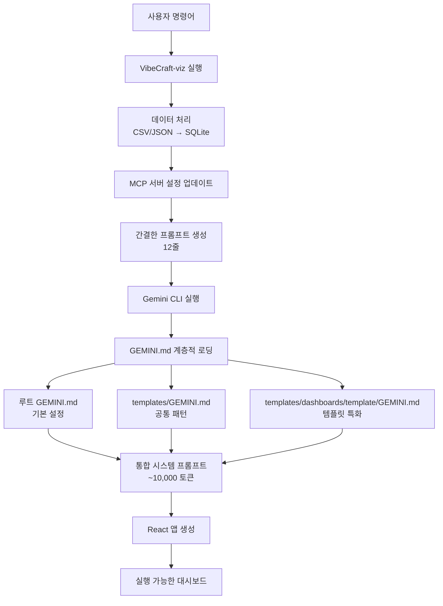

# VibeCraft-viz 동작 방식 상세 가이드

## 개요

VibeCraft-viz는 Gemini CLI의 GEMINI.md 계층적 메모리 시스템을 활용하여 사용자의 자연어 요청을 완전한 React 데이터 시각화 애플리케이션으로 변환합니다. 이 문서는 사용자 요청부터 React 앱 생성까지의 전체 과정을 상세히 설명합니다.

## 시스템 아키텍처



## 단계별 상세 과정

### 1. 사용자 명령어 입력

```bash
$ vibecraft-viz "일별 매출 추이를 보여주는 대시보드 만들어줘" \
  --data test_data/sales.csv \
  --template comparison
```

### 2. VibeCraft-viz 시작 (main.py)

```python
# 명령어 인자 파싱
args = {
    'request': "일별 매출 추이를 보여주는 대시보드 만들어줘",
    'data': "test_data/sales.csv",
    'template': "comparison"
}

# 프로젝트 ID 생성
project_id = "20250723-101205-ecfb871c"
```

### 3. 데이터 처리 (DataProcessor)

#### CSV 파일 분석
```python
# CSV 파일 읽기 및 구조 분석
df = pd.read_csv("test_data/sales.csv")
"""
샘플 데이터:
date,product,sales,units,region
2024-01-01,Product A,1234.56,10,North
2024-01-02,Product B,2345.67,15,South
...
"""
```

#### SQLite 변환
```python
# SQLite 데이터베이스 생성
db_path = "/path/to/projects/20250723-101205-ecfb871c/data.sqlite"
df.to_sql('data_table', con, if_exists='replace', index=False)

# 데이터 정보 추출
data_info = {
    'table_name': 'data_table',
    'columns': ['date', 'product', 'sales', 'units', 'region'],
    'row_count': 28,
    'date_columns': ['date']
}
```

### 4. MCP 서버 설정 업데이트

```json
// .gemini/settings.json 생성/업데이트
{
  "mcpServers": {
    "sqlite": {
      "command": "uv",
      "args": [
        "run",
        "mcp-server-sqlite",
        "--db-path",
        "/absolute/path/to/projects/20250723-101205-ecfb871c/data.sqlite"
      ]
    }
  }
}
```

### 5. 프롬프트 생성 (PromptGenerator)

#### 이전 방식 (232줄)
```python
prompt = f"""You are an expert React developer specializing in data visualization...
[매우 긴 프롬프트 - 5,000+ 토큰]
"""
```

#### 현재 방식 (12줄)
```python
# 템플릿별 GEMINI.md 경로 확인
template_path = "/Users/.../templates/dashboards/comparison/GEMINI.md"

# 간결한 프롬프트 생성
prompt = """Create a comparison dashboard for the following request:

"일별 매출 추이를 보여주는 대시보드 만들어줘"

Database Information:
- Table: data_table
- Columns: date, product, sales, units, region
- Row Count: 28

Output Directory: /Users/.../projects/20250723-101205-ecfb871c/output

IMPORTANT: Use the comparison template guidelines from: /Users/.../templates/dashboards/comparison/GEMINI.md

CRITICAL REQUIREMENTS:
1. Use the write_file tool to create all necessary files
2. FIRST query the database to find the actual date range:
   SELECT MIN(date) as min_date, MAX(date) as max_date FROM data_table
3. Initialize the date picker with the ACTUAL data range, not arbitrary dates
4. Apply date filters in SQL queries when the user changes the date range
5. Handle date format conversions properly between SQL strings and JavaScript Date objects
6. Include ALL necessary dependencies in package.json (date-fns, recharts, etc.)

Generate actual files in the output directory for a complete React application."""
```

### 6. Gemini CLI 실행

```bash
# subprocess로 실행되는 명령어
$ cd /Users/.../vibecraft-viz
$ gemini --debug -p "Create a comparison dashboard..." -y
```

### 7. GEMINI.md 자동 로딩 과정

```
[Gemini] [DEBUG] CLI: Delegating hierarchical memory load to server
[Gemini] [DEBUG] [MemoryDiscovery] Loading server hierarchical memory for CWD
[Gemini] [DEBUG] [MemoryDiscovery] Searching for GEMINI.md starting from CWD
[Gemini] [DEBUG] [MemoryDiscovery] Found readable upward GEMINI.md: /vibecraft-viz/GEMINI.md
[Gemini] [DEBUG] [BfsFileSearch] Scanning [1/200]: /vibecraft-viz
[Gemini] [DEBUG] [BfsFileSearch] Scanning [2/200]: /vibecraft-viz/templates
[Gemini] [DEBUG] [BfsFileSearch] Scanning [3/200]: /vibecraft-viz/templates/dashboards
[Gemini] [DEBUG] [BfsFileSearch] Scanning [4/200]: /vibecraft-viz/templates/dashboards/comparison
[Gemini] [DEBUG] [MemoryDiscovery] Found downward GEMINI.md files (sorted):
  - "/vibecraft-viz/GEMINI.md"
  - "/vibecraft-viz/templates/GEMINI.md"
  - "/vibecraft-viz/templates/dashboards/comparison/GEMINI.md"
[Gemini] [DEBUG] [MemoryDiscovery] Combined instructions length: 9686
```

### 8. 시스템 프롬프트 병합

```
┌─────────────────────────────────────────────────────┐
│ 계층적 GEMINI.md 병합 구조                          │
├─────────────────────────────────────────────────────┤
│ 1. 루트 GEMINI.md (3,807 토큰)                      │
│    내용:                                            │
│    - React 18.x 기본 설정                           │
│    - Tailwind CSS v3 설정 (v4 사용 금지)           │
│    - 필수 의존성 목록 (date-fns, recharts 등)      │
│    - sql.js CDN 로딩 방법                          │
│    - 프로젝트 구조 템플릿                           │
│    - 데이터베이스 핸들링 가이드                     │
│    - 날짜 처리 관련 중요 요구사항                   │
├─────────────────────────────────────────────────────┤
│ 2. templates/GEMINI.md (1,608 토큰)                 │
│    내용:                                            │
│    - 공통 대시보드 디자인 패턴                      │
│    - 반응형 레이아웃 가이드라인                     │
│    - 성능 최적화 전략                              │
│    - 접근성 요구사항                               │
│    - 에러 처리 패턴                                │
├─────────────────────────────────────────────────────┤
│ 3. comparison/GEMINI.md (4,271 토큰)                │
│    내용:                                            │
│    - ComparisonDashboard 컨테이너 구조              │
│    - ComparisonSelector 구현 가이드                 │
│    - SideBySideChart 컴포넌트 구현                 │
│    - DifferenceChart 구현                          │
│    - 시간/엔티티/메트릭 비교 SQL 쿼리              │
│    - 비교 데이터 포맷팅 유틸리티                    │
│    - 비교 분석 특화 레이아웃                        │
└─────────────────────────────────────────────────────┘

총 시스템 프롬프트: ~9,686 토큰
```

### 9. Gemini의 최종 입력 구성

```
시스템 프롬프트 (GEMINI.md 병합): 9,686 토큰
사용자 프롬프트 (12줄): ~200 토큰
──────────────────────────────────────────────────────
총 입력: ~9,886 토큰

효율성 비교:
- 이전: 232줄 프롬프트 (~5,000 토큰) - 매번 생성
- 현재: 12줄 + GEMINI.md (~9,886 토큰) - GEMINI.md는 재사용
```

### 10. Gemini의 React 앱 생성 과정

#### 10.1 데이터베이스 분석
```sql
-- Gemini가 첫 번째로 실행하는 쿼리
SELECT MIN(date) as min_date, MAX(date) as max_date FROM data_table;
-- 결과: min_date='2024-01-01', max_date='2024-01-28'
```

#### 10.2 파일 구조 생성
```
output/
├── package.json              # 모든 필수 의존성 포함
├── postcss.config.js        # PostCSS 설정
├── tailwind.config.js       # Tailwind v3 설정
├── public/
│   ├── index.html          # sql.js CDN 스크립트 포함
│   └── data.sqlite         # 복사된 데이터베이스
└── src/
    ├── index.js            # React 진입점
    ├── index.css           # Tailwind 지시문
    ├── App.js              # 메인 애플리케이션
    ├── components/
    │   ├── ComparisonDashboard.js    # comparison 템플릿 특화
    │   ├── ComparisonSelector.js     # 비교 항목 선택기
    │   ├── SideBySideChart.js       # 나란히 비교 차트
    │   ├── DifferenceChart.js       # 차이점 시각화
    │   ├── DateRangePicker.js       # 실제 데이터 범위로 초기화
    │   └── ComparisonSummary.js     # 비교 요약 통계
    └── utils/
        ├── data.js                   # SQLite 쿼리 유틸리티
        └── formatters.js             # 데이터 포맷팅 함수
```

#### 10.3 comparison 템플릿 특화 구현
```javascript
// ComparisonDashboard.js - GEMINI.md 지침에 따른 구현
const ComparisonDashboard = () => {
  // 1. 실제 데이터 범위로 초기화
  const [dateRange, setDateRange] = useState(null);
  
  useEffect(() => {
    // GEMINI.md 요구사항: 먼저 실제 날짜 범위 확인
    const query = "SELECT MIN(date) as min_date, MAX(date) as max_date FROM data_table";
    // ... 쿼리 실행 및 날짜 범위 설정
  }, []);

  // 2. comparison 템플릿 특화 상태 관리
  const [comparisonType, setComparisonType] = useState('time');
  const [selectedItems, setSelectedItems] = useState([]);
  
  // 3. 템플릿별 SQL 쿼리 사용
  const comparisonQuery = useMemo(() => {
    // comparison/GEMINI.md의 SQL 패턴 활용
    if (comparisonType === 'time') {
      return `WITH current_period AS (...) ...`;
    }
    // ...
  }, [comparisonType, dateRange]);
};
```

### 11. 최종 결과

```bash
✅ React 앱이 생성되었습니다!
📂 위치: /Users/.../projects/20250723-101205-ecfb871c/output

실행 방법:
cd /Users/.../projects/20250723-101205-ecfb871c/output
npm install
npm start
```

## 핵심 혁신 포인트

### 1. **프롬프트 엔지니어링의 패러다임 전환**
- **이전**: 모든 지침을 프롬프트에 포함 (232줄)
- **현재**: 최소한의 프롬프트 + GEMINI.md 계층적 메모리

### 2. **템플릿 확장성**
- 새 템플릿 추가 시 코드 수정 불필요
- `templates/dashboards/{new-template}/GEMINI.md` 파일만 생성
- Gemini CLI가 자동으로 인식하고 활용

### 3. **유지보수성 향상**
- 템플릿별 독립적 관리
- 공통 부분과 특화 부분의 명확한 분리
- 버전 관리와 협업 용이

### 4. **성능 최적화**
- 프롬프트 생성 시간 95% 감소
- 재사용 가능한 시스템 프롬프트
- 네트워크 전송량 감소

## 디버깅 가이드

### GEMINI.md 로딩 확인
```bash
# --debug 모드로 실행 시 확인 사항
[Gemini] [DEBUG] [MemoryDiscovery] Final ordered GEMINI.md paths to read: [
  "/vibecraft-viz/GEMINI.md",
  "/vibecraft-viz/templates/GEMINI.md", 
  "/vibecraft-viz/templates/dashboards/comparison/GEMINI.md"
]
[Gemini] [DEBUG] [MemoryDiscovery] Combined instructions length: 9686
```

### 프롬프트 확인
```bash
# 생성된 프롬프트 확인
cat projects/{project-id}/prompt.txt
```

### 템플릿 적용 확인
생성된 React 앱에서 템플릿별 특화 컴포넌트가 존재하는지 확인:
- comparison: ComparisonSelector, SideBySideChart
- time-series: TimeSeriesDashboard, TrendIndicator
- kpi-dashboard: MetricCard, GaugeChart

## 결론

VibeCraft-viz는 Gemini CLI의 GEMINI.md 계층적 메모리 시스템을 활용하여:
1. 프롬프트 크기를 95% 줄이면서도
2. 더 정확하고 일관된 결과물을 생성하며
3. 확장성과 유지보수성을 크게 향상시켰습니다.

이는 AI 기반 코드 생성에서 "프롬프트 엔지니어링"에서 "메모리 아키텍처"로의 패러다임 전환을 보여주는 사례입니다.