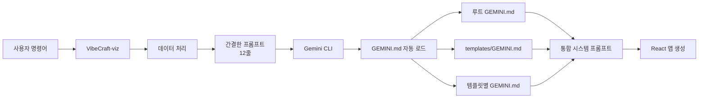

# VibeCraft-viz

Gemini CLI와 SQLite MCP 서버를 활용하여 사용자의 자연어 요청을 기반으로 완전한 React 데이터 시각화 애플리케이션을 자동 생성하는 도구입니다.

## 특징

- 🚀 **원샷 프롬프트**: 한 번의 명령으로 완전한 React 앱 생성
- 📊 **다양한 템플릿**: 10가지 전문 시각화 템플릿 제공
- 🔧 **자동화된 프로세스**: 데이터 처리부터 코드 생성까지 자동화
- 💾 **SQLite 기반**: 브라우저에서 실행 가능한 SQLite 데이터베이스
- 🤖 **Gemini CLI 통합**: AI 기반 코드 생성
- 🔐 **환경 변수 관리**: .env 파일로 안전한 설정 관리
- 🧠 **GEMINI.md 계층적 메모리**: 템플릿별 특화된 지침으로 확장성 확보

## 필수 요구사항

- Python 3.8+
- [uv](https://github.com/astral-sh/uv) (Python 패키지 매니저)
- [Gemini CLI](https://github.com/google/generative-ai-docs) 설치 필요

## 빠른 시작

### 1. 저장소 클론

```bash
git clone https://github.com/yourusername/vibecraft-viz.git
cd vibecraft-viz
```

### 2. uv 가상환경 설정

```bash
# uv 가상환경 생성
uv venv

# 가상환경 활성화
source .venv/bin/activate  # Linux/Mac
# 또는
.venv\Scripts\activate  # Windows
```

### 3. 의존성 설치

```bash
# 개발 모드로 설치
uv pip install -e .
```

### 4. 환경 변수 설정

```bash
# .env 파일 생성 (템플릿 복사)
cp .env.example .env

# .env 파일 편집하여 필요한 환경 변수 설정
```

### 5. 실행

```bash
# 가상환경에서 실행
vibecraft-viz "월별 매출 추이를 보여주는 대시보드 만들어줘" \
  --data test_data/sales.csv \
  --template time-series
```

## 사용법

### 기본 명령어

```bash
vibecraft-viz "<시각화 요청>" --data <데이터파일> --template <템플릿>
```

### 예시

```bash
# 시계열 분석
vibecraft-viz "월별 매출 추이와 전년 대비 성장률을 보여주는 대시보드 만들어줘" \
  --data test_data/sales.csv \
  --template time-series

# KPI 대시보드
vibecraft-viz "분기별 주요 KPI를 보여주고 목표 달성률을 게이지로 표시해줘" \
  --data metrics.csv \
  --template kpi-dashboard

# 지도 시각화
vibecraft-viz "매장별 매출을 지도에 히트맵으로 표시하고 지역별 통계도 보여줘" \
  --data stores.json \
  --template geo-spatial
```

## 지원 템플릿

| 템플릿 ID | 설명 | 주요 기능 |
|-----------|------|-----------|
| `time-series` | 시계열 분석 | 날짜 범위 선택, 트렌드 분석, 줌 기능 |
| `kpi-dashboard` | KPI 대시보드 | 메트릭 카드, 게이지 차트, 목표 대비 분석 |
| `comparison` | 비교 분석 | 그룹별 비교, 차이점 하이라이팅, 통계 요약 |
| `geo-spatial` | 지도 시각화 | 히트맵, 마커 클러스터링, 지역별 통계 |
| `gantt-chart` | 프로젝트 일정 | 작업 타임라인, 진행률, 의존성 표시 |
| `funnel-analysis` | 퍼널 분석 | 전환율, 단계별 이탈, 프로세스 최적화 |
| `cohort-analysis` | 코호트 분석 | 유지율, 그룹별 행동 패턴, 시간별 추이 |
| `heatmap` | 히트맵 | 밀도 분석, 패턴 인식, 다차원 데이터 |
| `network-graph` | 네트워크 그래프 | 관계 시각화, 노드 분석, 중심성 계산 |
| `custom` | 사용자 정의 | 자유로운 커스터마이징 |

## 프로젝트 구조

```
vibecraft-viz/
├── .venv/                    # uv 가상환경
├── .gemini/
│   └── settings.json        # MCP 서버 설정 (자동 생성)
├── GEMINI.md                # 루트 시스템 프롬프트 (React 기본 설정)
├── src/
│   ├── main.py              # CLI 진입점
│   ├── data_processor.py    # 데이터 처리 모듈
│   ├── project_manager.py   # 프로젝트 관리
│   ├── settings_manager.py  # Gemini 설정 관리
│   └── prompt_generator.py  # 프롬프트 생성 (12줄로 단순화)
├── templates/               # 대시보드 템플릿
│   ├── GEMINI.md           # 공통 대시보드 패턴
│   └── dashboards/
│       ├── time-series/
│       │   └── GEMINI.md   # 시계열 특화 지침
│       ├── comparison/
│       │   └── GEMINI.md   # 비교 분석 특화 지침
│       └── ...
├── projects/                # 생성된 프로젝트들 (자동 생성)
├── test_data/               # 테스트용 샘플 데이터
├── .env                     # 환경 변수 (생성 필요)
├── .env.example             # 환경 변수 예시
├── requirements.txt         # Python 의존성
├── setup.py                 # 패키지 설정
└── README.md
```

## 생성되는 React 앱 구조

```
projects/[project-id]/
├── data.sqlite              # 변환된 데이터베이스
├── metadata.json            # 프로젝트 메타데이터
├── prompt.txt               # 생성된 프롬프트
└── output/                  # React 앱
    ├── package.json         # npm 의존성
    ├── public/
    │   ├── index.html
    │   └── data.sqlite      # 복사된 데이터베이스
    ├── src/
    │   ├── App.js           # 메인 컴포넌트
    │   ├── components/      # UI 컴포넌트
    │   └── utils/           # 유틸리티 함수
    └── README.md
```

## 워크플로우

### GEMINI.md 계층적 로딩 시스템



### 상세 프로세스

1. **데이터 처리**: CSV/JSON 파일을 SQLite 데이터베이스로 변환
2. **프로젝트 생성**: 고유 ID로 프로젝트 디렉토리 생성
3. **MCP 설정 업데이트**: VibeCraft-viz 루트의 `.gemini/settings.json` 업데이트
4. **프롬프트 생성**: 12줄의 간결한 프롬프트 + 템플릿 경로 힌트
5. **Gemini CLI 실행**: 
   - GEMINI.md 파일들을 자동으로 스캔하고 로드
   - 계층적으로 병합된 ~10,000 토큰의 시스템 프롬프트 생성
   - AI가 템플릿별 특화된 React 코드 생성
6. **결과 전달**: 실행 가능한 React 앱 제공

## 환경 변수

`.env` 파일에서 필요한 환경 변수를 관리합니다. `.env.example` 파일을 참고하세요.

## MCP 서버 설정

VibeCraft-viz는 `.gemini/settings.json`을 통해 MCP SQLite 서버를 설정합니다:

```json
{
  "mcpServers": {
    "sqlite": {
      "command": "uv",
      "args": [
        "--directory",
        "/Users/infograb/Workspace/Personal/Competitions/vibecraft/vibecraft-agent-v3/",
        "run",
        "mcp-server-sqlite",
        "--db-path",
        "/absolute/path/to/data.sqlite"
      ]
    }
  }
}
```

Gemini CLI를 실행하면 이 설정을 자동으로 읽어 MCP 서버를 실행합니다.

## 문제 해결

### 환경 변수 오류

```bash
# .env 파일이 존재하는지 확인
ls -la .env

# .env.example을 참고하여 필요한 환경 변수 설정
cat .env.example
```

### MCP 서버 실행 오류

MCP SQLite 서버는 uv로 실행됩니다:

```bash
# uv 설치 확인
which uv

# uv가 없다면 설치
curl -LsSf https://astral.sh/uv/install.sh | sh
```

**중요**: MCP 서버는 `/Users/infograb/Workspace/Personal/Competitions/vibecraft/vibecraft-agent-v3/` 경로에 위치해야 합니다.

### 가상환경 문제

```bash
# 가상환경 재생성
rm -rf .venv
uv venv
source .venv/bin/activate
uv pip install -e .
```

### 데이터 파일 형식

- **CSV**: 첫 번째 행은 반드시 헤더여야 함
- **JSON**: 배열 또는 객체 형식 지원
- **인코딩**: UTF-8 권장

## 개발 가이드

### 새로운 템플릿 추가하기

1. 템플릿 디렉토리 생성:
```bash
mkdir -p templates/dashboards/your-template
```

2. GEMINI.md 파일 작성:
```bash
# 기존 템플릿 참고
cp templates/dashboards/time-series/GEMINI.md templates/dashboards/your-template/
# 템플릿에 맞게 수정
```

3. 테스트:
```bash
vibecraft-viz "테스트 요청" --data test.csv --template your-template
```

Gemini CLI가 자동으로 새 템플릿의 GEMINI.md를 로드하여 사용합니다.

### 로컬 개발 설정

```bash
# 개발 의존성 포함 설치
uv pip install -e ".[dev]"

# 코드 포맷팅
black src/

# 린팅
flake8 src/

# 타입 체크
mypy src/
```

### 테스트 실행

```bash
# 전체 테스트
pytest

# 특정 테스트만
pytest tests/test_data_processor.py
```

### GEMINI.md 디버깅

Gemini CLI의 --debug 모드로 GEMINI.md 로딩 과정 확인:
```bash
# 로그에서 확인할 내용
[Gemini] [DEBUG] [MemoryDiscovery] Final ordered GEMINI.md paths to read: [...]
[Gemini] [DEBUG] [MemoryDiscovery] Combined instructions length: 9686
```

## 기여하기

1. Fork the repository
2. Create your feature branch (`git checkout -b feature/amazing-feature`)
3. Commit your changes (`git commit -m 'Add some amazing feature'`)
4. Push to the branch (`git push origin feature/amazing-feature`)
5. Open a Pull Request

## 라이선스

이 프로젝트는 MIT 라이선스 하에 배포됩니다. 자세한 내용은 [LICENSE](LICENSE) 파일을 참조하세요.

## 문의

- 이슈: [GitHub Issues](https://github.com/yourusername/vibecraft-viz/issues)
- 이메일: vibecraft@example.com

## 감사의 말

- [Gemini CLI](https://github.com/google/generative-ai-docs) - AI 기반 코드 생성
- [MCP Protocol](https://modelcontextprotocol.io/) - Model Context Protocol
- [sql.js](https://github.com/sql-js/sql.js/) - 브라우저용 SQLite